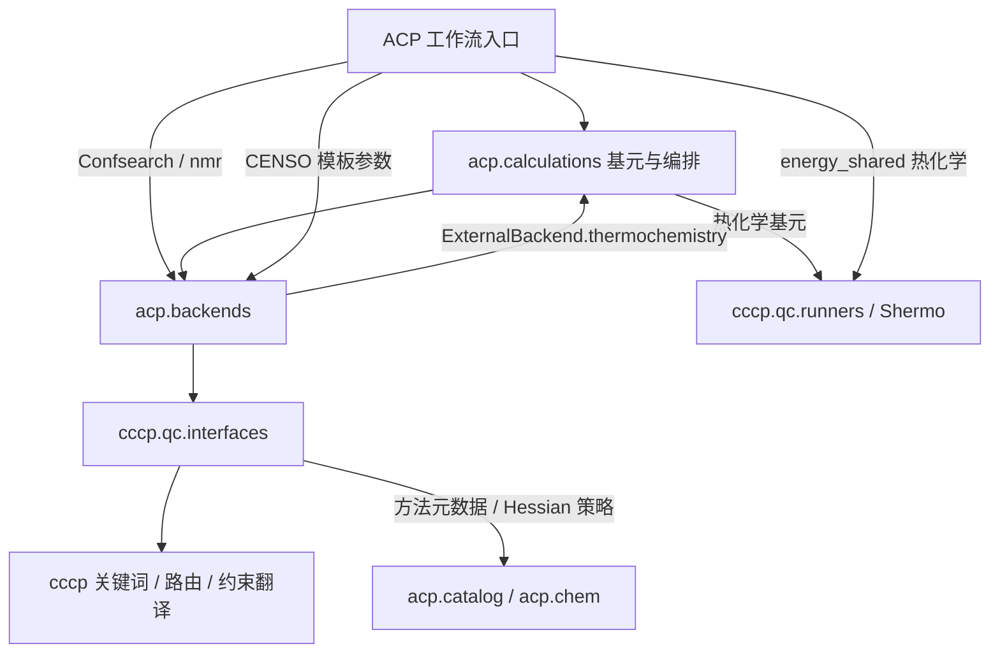
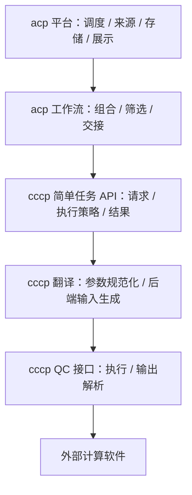

# ACP / cccp 四层架构符合性审计报告

- **初次审计日期**：2026-10-02；**本次复核日期**：2026-10-03
- **代码基线**：`main@88def44`；本次只修订报告，未修改运行代码。
- **源码范围**：`src/cccp/`（37 个 Python 文件，16,132 行）、`src/acp/`（241 个 Python 文件，105,542 行）。行数含空行和注释，仅描述规模。
- **方法**：源码静态审查、Python 3.11 AST 导入统计、活跃工作流调用链追踪，以及禁止启动外部进程的隔离探针。未运行真实 QC 计算、远程作业或完整测试集。
- **判定基准**：保留原报告列出的三项设计要求；现有代码和历史重构文档用于说明实现现状，不据此自动放宽目标。

## 0. 设计逻辑与结论

### 0.1 本报告遵循的三项要求

1. **四层职责分立**：工作流层属于 `acp`；简单任务层、翻译层、QC 接口层属于 `cccp`。
2. **工作流复用简单任务**：工作流组织任务的顺序、筛选与交接，通过简单任务 API 执行计算；不能靠薄 backend 包装绕过任务层。
3. **cccp 独立可调用**：在没有 `acp` 的环境中，仍能通过 Python API 调用已定义的简单任务，并按所需能力选择后端。

**严格验收约束**：以上三项均为硬要求。遗留例外、兼容包装、分阶段迁移只能说明尚未完成的工作，不能豁免最终验收。当前总判定为**不通过**；已有收口成果只是后续整改基础。不能通过重命名目录、增加一层转发、静默 fallback 或放宽设计定义消除问题编号。

由此理解，ACP 负责组合科学流程和平台服务，cccp 负责可复用的计算能力。统一 CLI 可以继续留在 ACP；**是否有独立 CLI、是否从包根 re-export，均不是 R3 的必要条件**。独立发布安装包是另一个交付问题，应与运行时不依赖 ACP 分别验收。

这里的“简单任务”按职责定义：接受明确输入，执行一种计算能力，返回结构化结果。几何优化内部的重试、扫描的多个点、IRC 的双向执行，并不因有循环就自动成为平台工作流。相反，PES 候选筛选、人工审核、任务来源查询等职责也不会因放进 `calculations/` 就自动成为简单任务。

### 0.2 结论摘要

| 要求 | 判定 | 已核实的依据 |
|---|---|---|
| R1：下三层归 cccp，职责分立 | **未满足** | 底层接口主要在 cccp；任务契约、基元和计划执行主要在 `acp/calculations`；翻译逻辑横跨 cccp 接口、ACP catalog 和工作流辅助函数。 |
| R2：工作流只经简单任务执行计算 | **部分实现，尚未收口** | 12 个活跃 QC 工作流中，10 个入口委托 `acp/calculations`；Confsearch 和 nmr 直接消费 backend。另有 PES 内部直调 backend、工作流拼装输入片段等问题，不能把“进入 calculations”直接算作完整合规。 |
| R3：cccp 是独立可调用的多后端任务库 | **未满足** | 已有可导入的接口 API，但缺统一任务 API；隔离 ACP 后，ORCA 优化输入生成失败，部分方法默认参数静默变化。 |

已有的正面基础是：ORCA、CREST、xTB、CENSO、ISOSTAT、Molclus 的直接计算进程调用集中在 `cccp/qc/interfaces`；Shermo 集中在 `cccp/qc/runners`；ACP 工作流和 backend 中未发现直接启动这些 QC 二进制的代码。**进程执行收口已经建立，任务与翻译职责尚未完全收口。**

### 0.3 本次对原稿的主要修正

- 撤回“按现状重定义四层、默认放宽 R2/R3”的建议，改为保留目标、分阶段抽取任务核心。
- 撤回“工作流零 QC 输入拼装”：`energy_shared.resolve_levels()` 会生成 CENSO 使用的 ORCA `!` 行。
- 将“10/12 合规”改为“10/12 入口委托 calculations”；补充 PES 扫描和批量 SP 的独立执行路径。
- 将“cccp 无公共 API”改为“已有接口 API，缺统一任务 API”；澄清两个包目前随同一个 `acp` distribution 安装。
- 将“只有默认 auto 优化会失败”修正为：隔离 ACP 时，优化输入路径的 Hessian resolver 无条件导入 ACP，显式 `0` 和 `10` 也失败。
- 补充 backend 反向调用计算基元、CREST 能力矩阵失真；合并重复问题，删除未经验证的“规模翻三倍”“3–5 天”等估算。

---

## 1. 审计口径与证据边界

### 1.1 源码与文档的关系

[现行重构方案](ACP_Calculation_Workflow_Refactor_Cleanup_Plan.md) 将计算基元统一到 `acp/calculations`，并保留 Confsearch/NMR 的科学能力；这解释了当前布局。[README](../README.md) 将 cccp 描述为底层接口库，并取消其独立 CLI。这些是现状与历史决策的证据，不能证明本报告的三项目标已经完成或应该取消。

本次核对了根及相关嵌套 AGENTS.md、上述重构方案、简单工作流文档和文件布局规范。遇到知识库与实现不一致时，在报告中记录差异；本次不修改其他文档或工程规则。

### 1.2 统计与判定方式

| 检查 | 范围与结果 | 限制 |
|---|---|---|
| 文件规模 | 当前源码树所有 `.py` | 不用历史文档中的近似行数代替当前统计。 |
| ACP → cccp 导入 | 51 个文件中共 121 条绝对 `from cccp... import ...` 语句，包含函数内导入 | 导入 parser、数据契约、工具函数不等于调用 QC 执行接口；统计也不等于动态调用图。 |
| 子进程 | `src/` 中 13 个文件含 `import subprocess`（含别名）；另追踪 SSH 执行封装 | 区分 QC 计算、软件探测、ACP 任务进程和集群管理命令。 |
| 工作流 | catalog 的 12 个活跃 QC 工作流，结合 registry 与 CLI dispatch | 不含 registry 的 `fake` 演示项；退役入口实现仍被 Confsearch/NMR 使用时纳入。 |
| 独立性 | 新 Python 进程阻断全部 `acp` 导入，检查 cccp 输入生成与协议解析 | 模拟运行时隔离，未构建独立 cccp wheel，也未验证 QC 软件的数值结果。 |
| 能力选择 | 检查 registry、能力矩阵与被选方法是否可调用 | 结构 Protocol 匹配不能证明方法已实现或二进制可用。 |

全文使用“未发现仓库生产调用方”，不据此断言外部用户没有使用导出的 API。隔离探针的结果与静态推断分别注明，复现方法见附录 B。

---

## 2. 四层设计与实际落位

| 职责 | 目标归属 | 当前主要实现 | 复核判断 |
|---|---|---|---|
| 工作流：步骤组合、筛选、交接 | acp | `workflows/`、`confsearch/`，以及 `calculations/pes`、`batch`、`tsmode` 中的部分策略 | 大体在 ACP，但逻辑层不能按目录名直接划定。CLI 是入口，registry 是元数据登记。 |
| 简单任务：请求、执行策略、结果 | cccp | `acp/calculations/contracts.py`、`primitives/`、`executor.py` 等 | 可复用能力已有基础，包归属不符合 R1；平台职责与计算职责混合。 |
| 翻译：统一参数 → 后端输入 | cccp | `cccp/qc/keyword_registry.py`、接口内 renderer/builder、`utils/solvent_map.py`；另散落 ACP | 部分已模块化，但有反向依赖和工作流层的输入文本生成。 |
| QC 接口：软件调用与输出解析 | cccp | `qc/interfaces/`、Shermo 的 `qc/runners/` | 直接 QC 进程执行基本集中；接口方法还同时承担部分翻译与工具链编排。 |
| 能力适配 | 下三层的实现机制 | `acp/backends/` | Protocol 适配本身有价值；但其归属、批量执行和反向依赖需进一步拆分。 |

**主要调用关系（现状，并非目标）**：



图中的两个回向依赖是实际代码关系，不能用“单向栈自洽”概括。翻译也不是当前所有 backend 调用都必经的一个独立模块。

### 2.1 为什么不能整目录搬迁 calculations

依赖检查发现：

- `executor.py` 负责 `WORK/` 布局、checkpoint、`RESULT/result_manifest.json`，还调用 ACP 结果工具。
- `primitives/scan.py`、`irc.py` 写平台清单；`frequency.py` 使用 ACP 的振动结果产品构建器。
- `irc/source.py` 依赖 `scheduler.jobs.JobRecord/JobStatus` 和结果来源校验；远程 fetcher 的导入仅在 `TYPE_CHECKING` 下。
- `tsmode/engine.py` 返回 `WorkflowResult`；`batch/_manifest.py` 从 `confsearch.shared.artifacts` 复用文件工具。
- 与之相对，`contracts.py` 当前只导入标准库，不能笼统声称整个契约层都深度依赖平台。

这些证据支持**先按职责解耦，再迁移通用计算核心**。它们不支持“任务层永远不应下沉”的结论，也不要求把调度数据库、人工审核或平台结果展示一起放入 cccp。

### 2.2 cccp 遗留编排代码的真实状态

| 模块 | 现状 | 可得结论 |
|---|---|---|
| `pipeline/executor.py` | `execute_final_opt_sp()` 接收 `engine: Any` 并调用其私有 handoff 方法；docstring 说明旧 engine 已删除；另有候选选择辅助方法 | 缺仓库内的完整配套引擎，不能承担目标任务层。它没有 import 已删除 engine，模块本身并非必然导入失败。 |
| `core/state_manager.py` | 仍由 `cccp.core` 导出，未发现仓库生产实例化调用 | 属遗留公开面，不能直接等同于可无条件删除的死代码。 |
| `core/protocols.py` | 可调用、仍被导出；供旧 pipeline 和协议测试使用，未发现 ACP 活跃计算路径调用 | 是遗留协议解析器，不能替代通用任务 API。 |
| `qc/cluster/__init__.py` | Local/LSF 适配器仍导出，配置测试使用；ACP 远程调度不经它 | 与 ACP 调度实现并存，需明确支持与弃用范围。 |

---

## 3. 要求逐项复核

### 3.1 R1：QC 接口与翻译边界

#### 3.1.1 进程执行收口

| 外部程序 | 直接计算执行位置 |
|---|---|
| ORCA | `cccp/qc/interfaces/orca.py::_run_orca`（`subprocess.run` / 流式 `Popen`） |
| CREST | `cccp/qc/interfaces/crest.py`（search、batch optimization） |
| xTB | `cccp/qc/interfaces/{xtb,xtb_path,xtb_thermo,molclus}.py` |
| CENSO | `cccp/qc/interfaces/censo.py::refine_ensemble` |
| ISOSTAT / Molclus | `cccp/qc/interfaces/{isostat,molclus}.py` |
| Shermo | `cccp/qc/runners/__init__.py::run_shermo` |

Shermo 是同一个 cccp 包内的另一处执行模块。是否归入 QC 接口层应按职责说明；不在 `interfaces/` 目录并不自动构成架构违规。真正的 R2 问题是工作流跳过已有热化学任务，直接调用 runner。

其他进程执行包括 `cccp/software.py` 的环境/版本探测、cccp 遗留集群适配器，以及 ACP 调度与浏览器打开。原稿遗漏了 `acp/scheduler/runner.py:599,998` 的本地任务 `Popen`：它启动 ACP 任务进程，属于平台调度，不能据此判为工作流直接启动 QC。远端路径经 SSH 执行 bsub/bjobs/bkill/bstop/bresume 等命令。

#### 3.1.2 翻译已有基础，但职责仍散落

已分离的模块包括：

- `keyword_registry.py`：方法族、参数词表、规范化与适用性策略，明确禁止导入 ACP。
- `interfaces/route_render.py`：ORCA `!` 行渲染与受管关键词去重。
- `interfaces/constraints.py`、`xtb_scan.py`：约束/扫描契约及后端文本渲染。
- `utils/solvent_map.py`、`resource_utils.py`：溶剂名和资源参数转换。

未完全分离的部分包括 ORCA 的 `_build_input_blocks/_write_input/_write_nmr_input`、TS/IRC 的 route/block 生成、CENSO rcfile/template/argv、Molclus 配置文件和 CREST/xTB argv。**缺少名为 `translation/` 的包不是判定依据**；要看能否在不运行软件、不依赖 ACP 的条件下复用并验证翻译。

此外，`acp/workflows/energy_shared.py:259-260` 和 `acp/confsearch/shared/helpers.py:182-183` 都用 `"! " + " ".join(...)` 拼路由行。前者被 `energy.py:433-436` 传给 CENSO，接口的 `write_part_templates()` 直接写入这些行，未统一经过 `render_route_line`。后者的同名辅助函数目前主要见于测试和 re-export，不能把两份都算成已确认活跃执行路径。

重复映射也要分清用途：`batch/effective_config.py::build_orca_summary` 生成的是人读摘要；另两份 helper 生成实际执行参数/输入片段。三处存在词表漂移风险，但不能说三处都直接写 QC 输入。`levels.canonical_level` 的 GFN 历史配置迁移与底层 renderer 的严格校验职责也不同，合并前需保留迁移告警语义。

#### 3.1.3 反向依赖及具体影响

| 导入位置 | 依赖 | 触发条件与影响 |
|---|---|---|
| `cccp/qc/interfaces/orca.py:137` | `acp.catalog.METHOD_META`、私有 `_case_insensitive_get` | 有 `ImportError` 保护，但缺 ACP 时返回空元数据，改变输入默认值。隔离探针确认 DLPNO 的默认 `auxJ/auxC` 消失。 |
| 同文件 `:155` | `acp.chem.composition.resolve_recalc_hess` | 无保护；`_build_input_blocks()` 的 `Opt` 分支无条件取 resolver。显式关闭 Hessian 重算也无法绕开导入。 |
| `cccp/core/protocols.py:281` | `acp.chem.composition.normalize_recalc_hess` | `levels.optimization.recalc_hess` 非 `None` 时触发；未传该覆盖的协议解析可成功。 |

Lazy import 只延迟导入，并未解除运行时依赖。两个包随同发行时通常可掩盖该问题；它直接阻断的是目标中的 cccp 隔离使用，不能据此声称当前 ACP 所有优化作业都会失败。

### 3.2 R2：工作流到简单任务的调用纪律

| 活跃工作流 | 已核实的主要计算路径 | 边界判断 |
|---|---|---|
| singlepoint | `workflows/simple.py` → `build_simple_plan` → `CalculationPlanExecutor` → `run_singlepoint` | 已经基元 |
| optimize | 同上 → `run_optimize` | 已经基元 |
| frequency | 同上 → `run_frequency` | 已经基元 |
| xtb_optimize | 同上，backend 为 xTB → `run_optimize` | 已经基元 |
| casscf | 同上 → `run_casscf` | 已经基元 |
| scan | `simple.run_scan` → `primitives.scan.run_scan` | 已经基元 |
| irc | `workflows/irc.py` → `build_irc_request` → `primitives.irc.run_irc` | 已经独立 IRC 基元 |
| BatchOptimize | `workflows/batch_optimize.py` → `BatchOptimizeEngine` → Opt/Freq/SP/Thermo 基元 | 已复用基元；批量组织与平台产物职责仍需区分 |
| tsmode | `workflows/tsmode.py` → `TsmodeEngine` → Opt/Freq 基元 | 已复用基元；模式选择与产物交接是上层策略 |
| PESsearch | `workflows/pes_search.py` → `PesSearchEngine/run_pes_scan` → 扫描 backend、批量 SP 执行器 | 入口进入 calculations，但内部没有统一复用普通 scan/SP 基元 |
| Confsearch | 四协议 → ensemble/energy/xtbmd 复用实现 → CREST/CENSO/Molclus/xTB/ISOSTAT/ORCA backend；DFT handoff → Shermo runner | 绕过统一任务层 |
| nmr | 构象生成 → ensemble；GIAO → `get_backend("orca")` → `nmr_shielding` | 构象与 NMR 计算均未统一到任务 API |

**不能只看 import 数量判定合规**：Confsearch/NMR 引用 `calculations.progress` 是进度上报，不是计算任务调用；解析器或约束数据类型的深路径 import 也不等于直接驱动 QC。

PES 的遗漏具体在 `calculations/pes/scan.py::_run_relaxed_scan_backend`：自行构造 backend 并调用 `relaxed_scan`。批量 SP 经 `calculations/batch/singlepoint.py`、`_singlepoint_execution.py` 和 `backends/batch.py` 执行，具有并发与缓存职责。需要核对它们与通用基元的语义差异，再决定抽取共享任务核心，不能用替换一个 import 的方式假定等价。

Confsearch 的 Shermo 路径还需区分“模块导入”和“实际调用”：`xtb-crest` 会导入 ensemble 及其辅助模块，但使用纯 xTB 路径；`censo-crest` 的 DFT 精修分支，以及 `xtbmd-censo` 的相应分支，才会进入 `run_rank1_handoff()` 的 Shermo 执行。并非所有协议每次都运行 Shermo。

`workflows/AGENTS.md` 当前允许经 backend 执行，并明确容许遗留 `run_shermo` 导入。因此这些路径可以符合该文档的宽口径，却仍不满足本报告更严格的 R2；原稿“按 house rule 仅 Shermo 违规”的说法不准确。

### 3.3 R3：独立调用能力

| 检查项 | 当前状态 |
|---|---|
| Python 接口 API | **存在**：`cccp.qc.interfaces` 导出 ORCA/CREST/xTB/CENSO 等接口与结果类型；`cccp.qc`、`cccp.core` 也有导出。根包只导出版本号不等于整个库没有公共 API。 |
| 后端独立调用 | **部分具备**：配置、参数翻译与接口类可被 Python 调用；存在工具内部编排，如 Molclus/CENSO。但尚无统一简单任务入口和一致的能力选择契约。 |
| 运行时不依赖 ACP | **不满足**：上节三处反向导入及隔离探针证明失败/行为变化。 |
| 独立 CLI | **不存在，但不是 R3 阻碍**：现行规则要求统一使用 `acp` CLI，无需为本目标恢复 `python -m cccp`。 |
| 独立安装交付 | **未提供独立定义**：`pyproject.toml` 的项目名为 `acp`，包发现包含 `cccp*` 和 `acp*`。本次“无 ACP”指隔离探针，不是当前已有一种官方“裸 cccp 安装”。 |
| 统一任务编排 | **尚未形成**：任务请求/结果与执行策略主要在 ACP；遗留 pipeline 不能填补该缺口。 |

#### 3.3.1 无外部计算的复现结果

使用 Python 3.11.13，阻断 `acp` 的 import finder，并把 `subprocess.run/Popen` 设为一旦调用就报错：

| 探针 | 观测结果 |
|---|---|
| 导入 `cccp.qc.interfaces.orca.ORCAInterface` | 成功，说明不是所有 cccp import 都失败 |
| 优化输入生成，`recalc_hess=None / "auto" / 0 / 10` | 四种均在导入 ACP resolver 时抛 `ModuleNotFoundError` |
| 旧协议解析，无 Hessian 覆盖 | 成功 |
| 旧协议解析，`optimization.recalc_hess=0` | 抛 `ModuleNotFoundError` |
| DLPNO SP 输入，相同 method/basis | ACP 被阻断时缺默认 `auxJ/auxC`；允许 ACP 后二者出现 |
| `require_backend("optimization")` / `"single_point"` / `"frequency"` | 均选到 `CrestBackend`；三个对应方法均抛 `NotImplementedError` |
| `supports("crest", ...)` | optimization 与 single_point 返回 True；frequency 返回 False，表明矩阵与 registry 的判断也不一致 |

这些探针验证调用边界和输入默认值，不证明任何真实 QC 计算收敛或失败。

### 3.4 原稿遗漏的两个层间问题

1. **Backend 反向调用计算基元**：`backends/external_backend.py:10-14` 从计算层导入 `JsonValue` 及热化学基元；`ExternalBackend.thermochemistry()` 调用 `ThermochemistryCalculator.compute()`。整体关系是 calculations → backends，同时 backends → calculations。原稿“所有 backend 都是直通 cccp 的薄适配”不成立。`backends/batch.py` 还承担并发、缓存等执行职责。
2. **能力发现存在可复现的错误选择**：`BackendRegistry.require()` 对按名称排序的类仅做 `issubclass(..., Protocol)` 判断；CREST 的 stub 方法满足结构类型，因此被选中。`CAPABILITY_MATRIX` 还把 CREST optimization/SP 标为 AVAILABLE。当前未发现仓库生产代码调用 `require_backend()`，所以应记录为该公共 API 的缺陷与未来通用任务路由的阻碍，不扩大成所有现有工作流的故障。

---

## 4. 风险与问题清单

优先级区分“当前 API 行为问题”和“相对四层目标的架构缺口”。沿用原稿编号便于追踪；原 F12 合并到 F1，原 F14 合并到 F5。

| ID | 优先级 / 性质 | 问题与影响 | 主要证据 |
|---|---|---|---|
| F1 | 高 / 隔离使用正确性 | 无保护反向导入阻断 ORCA 优化输入和带 Hessian 覆盖的旧协议解析 | `orca.py::_get_resolver/_build_input_blocks`；`protocols.py::resolve_protocol_spec`；探针 |
| F2 | 高 / 目标缺口 | cccp 缺统一任务 API，遗留 pipeline 不具备配套执行引擎 | `pipeline/executor.py`；`acp/calculations/contracts.py`、`primitives/` |
| F3 | 高 / 调用边界 | Confsearch/NMR 绕过任务层；PES 内另有扫描/SP 执行路径 | §3.2 调用链 |
| F4 | 中 / 任务复用 | 活跃 DFT handoff 直接调用 Shermo runner，未复用热化学基元；runner 所在目录本身不是错误 | `energy_shared.py::run_rank1_handoff` |
| F5 | 高 / 输入一致性 | 方法默认数据反向取自 ACP；缺 ACP 时静默改变输入，且依赖私有查询函数 | `orca.py::_resolve_method_meta`；DLPNO 探针 |
| F6 | 中 / 翻译一致性 | 工作流生成路由文本；执行辅助映射与展示摘要映射重复 | `energy_shared.py::resolve_levels`、`confsearch/shared/helpers.py`、`batch/effective_config.py` |
| F7 | 中 / 可分离性 | 输入构建、文件写入、进程调用仍混在多个接口类中 | `orca.py`、`orca_ts.py`、`censo.py`、`molclus.py` |
| F8 | 中 / 维护边界 | cccp Local/LSF 与 ACP 远程调度并存，能力与生命周期语义不同 | `cccp/qc/cluster`；`acp/scheduler/remote` |
| F9 | 中 / API 契约 | 接口 API 已有，任务 API 缺失；parser/contract/renderer 的稳定公开面未统一说明 | 各 `__all__` 与 ACP 深路径导入；不能据未 re-export 就判为私有 |
| F10 | 低 / 契约一致性 | cccp 部分接口使用 ABC，其他使用各自类型；统一能力 Protocol 主要在 ACP | `interfaces/base.py`、`backends/base.py`；不要求强制改为同一继承体系 |
| F11 | 低 / 文档漂移 | cccp AGENTS 版本仍为 1.1.0；workflow/core 知识库有过时描述 | 当前源码版本为 0.1.3，ACP 包版本由 distribution 元数据读取并有同值 fallback |
| F13 | 高 / 公共 API 正确性 | registry 可选中 stub；CREST 能力矩阵也存在错误标注 | `backends/{registry,crest,capabilities}.py`；探针 |
| F15 | 中 / 依赖方向 | `ExternalBackend` 反向调用计算基元；backend 包内另有批量执行逻辑 | `external_backend.py::thermochemistry`；`backends/batch.py` |
| F16 | 中 / 迁移边界 | calculations 混有平台来源、结果产品、审核及工作流策略，不能整体视为简单任务层 | §2.1 依赖检查；`calculations/{irc/source,pes/review,tsmode/engine}.py` |

文档漂移还包括 `core/AGENTS.md` 对旧协议解析来源的描述：当前 `resolve_protocol_spec()` 实际读取 `config.get("protocols", {}).get(protocol, {})`（`:166`）。这不等于现役 Confsearch 使用该旧解析器；两个问题需分别描述。**本报告不据此修改当前 AGENTS 的配置维护规则。**

---

## 5. 整改建议：保留设计目标，逐步抽取任务核心

本节是后续实现建议，尚未执行。原稿中外部复核意见可作为讨论输入，但不能代替源码证据或设计者对目标的选择。

### 5.1 目标边界



这是职责图，不要求每层只有一个类或函数。能力 Protocol、后端注册与适配可以作为 cccp 下三层的内部机制；平台路径和结果持久化通过 ACP 适配层处理。库可以写计算工作目录和原始产物，但无需知道 `JobRecord`、人工审核状态或工作台视图。

| 保留在 ACP | 适合抽取至 cccp 的内容 |
|---|---|
| CLI/API、任务数据库、远程作业生命周期、结构来源组织 | 通用计算请求/结果与后端能力契约 |
| Confsearch 协议组合、PES 候选选择、NMR 平均/DP4/DP5 | 优化、SP、频率、扫描、IRC、CASSCF、热化学等任务执行核心 |
| 工作台 manifest 产品映射、帧视图、平台恢复记录 | 方法默认数据、Hessian 解析策略、参数与输入翻译 |
| 多任务/多结构的业务编排与交接 | 按需要抽取的通用批量执行、局部重试与计算级恢复能力 |

构象采样、MD、聚类、CENSO 精修、NMR shielding 也需要明确的任务边界，才能让 Confsearch/NMR 完全遵循 R2。一个任务可以包装外部工具自身的内部流水线，不必把 CENSO 的科学流程重写一遍。

### 5.2 P0：先消除独立性和能力选择的确定性缺陷

1. 将纯 Hessian 策略及其类型、常量迁到 cccp，ACP 旧路径兼容导出；禁止下层再回读 ACP。不要用 `try/except ImportError` 加另一套默认值掩盖缺失，否则会引入新的行为分叉。
2. 抽取 METHOD_META 中计算语义所需的数据及查询逻辑；ACP catalog 再组合 UI 字段。不要把整个 catalog 原样搬下去，也不要在两侧复制默认表。
3. 修正 CREST 能力状态与 registry 选择规则，区分“方法存在”“已经实现”“所需软件可用”。拒绝不支持的请求应发生在启动计算前。
4. 固化隔离验证：在全新进程中阻断 ACP 导入，验证 cccp 任务核心可导入、输入可生成，且与 ACP 调用得到相同参数语义。仅检查 `acp not in sys.modules` 不够，因为后续仍可能导入它。

完成 P0 只说明独立性基础缺陷得到修复，**不能提前宣布 R1–R3 全部满足**。

### 5.3 P1：抽取第一个可独立调用的任务闭环

以已有 singlepoint/optimize 核心为起点，抽取最小完整路径：请求 → 后端能力选择 → 翻译 → 接口执行 → 结构化结果。复用已有实现，避免新建一套与 ACP 并行维护的计算逻辑。

- 可使用 `cccp.tasks` 等专门模块提供稳定 API；名称是建议，不要求在 `__init__.py` 内放实现。
- ACP 原入口保留兼容包装，负责平台输入来源、进度适配、manifest 和显示数据。
- 继续拆出频率、scan/IRC、CASSCF/热化学的通用部分；保持 IRC 独立于 BatchOptimize 的既有任务语义。
- 解开 `ExternalBackend → ThermochemistryCalculator` 的上行依赖，使统一热化学任务拥有执行与结果语义。

现行根 AGENTS 要求新基元驻留 `acp/calculations`；开始上述迁移时，需要把目标架构、迁移阶段与新驻点同步写入工程规则。此报告提供迁移依据，本次并未绕过或修改该规则。

### 5.4 P2：迁移工作流调用与输入翻译

1. 将 Confsearch 的 DFT handoff 和 Shermo 调用改接统一任务，保留其构象筛选与精修策略。
2. 为 NMR shielding、采样/MD/聚类/CENSO 精修建立明确任务入口，再逐条接入 Confsearch/NMR。
3. 对齐 PES 与通用 scan/SP 的请求、错误、恢复和产物语义，保留必要的批量缓存与并发能力。
4. 让工作流传结构化参数；后端 token 与 CENSO 模板文本由翻译层生成。人读参数摘要从同一规范化结果派生。
5. 增加依赖守护：工作流不能执行性调用 backend/QC runner，也不能自行拼后端输入。解析器和只读数据契约应有明确允许边界。

迁移尚未完成的调用必须保留为未关闭问题。最终验收不允许 Confsearch、NMR、PES 或 Shermo 的执行路径以“历史原因”“已登记例外”豁免。兼容入口只能向新的唯一任务实现转发，不能保留另一套计算、默认值或结果解释逻辑。

### 5.5 P3：清理和交付

- 在内部调用、导出、测试及外部兼容范围确认后，再弃用旧 pipeline/state/cluster API；不能仅凭内部调用少直接删除。
- Confsearch/NMR 改线前保留它们仍复用的退役入口实现；不恢复退役 CLI。
- 可将 Shermo runner 正式归入接口职责，或迁移至独立接口模块并兼容旧导入；目录统一不是最高优先级。
- 同步 AGENTS/README 与架构文档，明确公开任务 API、支持能力及依赖方向。
- 若需要 cccp 独立分发，再补充单独的构建与依赖定义；统一 `acp` CLI 可以继续保留。

### 5.6 必须全部满足的验收条件

每项都需要实现证据和验证结果。未覆盖、因环境跳过或仅有 mock 的部分必须标为未验证；不能据此给出整体通过结论。

| 编号 | 硬性条件 | 验证要求 |
|---|---|---|
| A1 | 通用任务、翻译、QC 接口三层均在 cccp，依赖不回到 ACP | 静态导入检查覆盖函数内导入；在无 ACP 源码/安装包的隔离环境中导入和调用公开任务 API，动态导入也不能绕过约束。 |
| A2 | cccp 的任务 API 拥有实际执行核心 | 请求校验、能力选择、执行及结果归一化能独立完成；禁止 `cccp.tasks` 再转发 `acp.calculations`，或靠注入 ACP 私有对象才能运行。 |
| A3 | 所有活跃工作流只通过简单任务执行 QC | 为 12 个工作流建立调用矩阵；逐一覆盖 Confsearch 四协议及其合法精修分支、NMR GIAO、PES scan/SP、BatchOptimize 各 profile、TS 与 IRC 路径。不能只检查默认分支。 |
| A4 | 同一种计算能力只有一个共享任务执行核心 | 普通、批量、PES、Confsearch 调用共用核心；并发、筛选、缓存策略可以不同，但不能各自保留优化/SP/频率/热化学的第二套实现。 |
| A5 | 工作流不生成后端语法，翻译不依赖平台数据 | 检查 ORCA route/block、CENSO template、xTB control/argv 的所有构建点；关键默认值和归一化只有一个来源；显示摘要与实际输入一致。 |
| A6 | 能力声明、选择与实现一致 | 对每个声称支持的后端×任务组合验证实际方法；stub 不能标为 AVAILABLE 或被选择；不支持能力、缺二进制、计算失败分别给出明确结果。 |
| A7 | 独立调用与 ACP 调用具有一致的计算语义 | 同输入得到一致的有效参数、翻译输入、单位、结果解释与错误语义；覆盖默认值、显式覆盖、恢复与失败路径。不能仅以 import 成功验收。 |
| A8 | ACP 平台契约完整保留 | 对任务目录、manifest、帧投影、checkpoint、远程读写、暂停/继续/取消、历史任务只读兼容运行针对性回归；迁移不能通过删除能力绕过失败。 |
| A9 | 验证包含真实计算与文档收口 | 按已声明支持范围执行代表性真实 QC 小样与必要的远程生命周期验证，记录软件版本、输入和结果；同步公开 API、工程规则、依赖和迁移文档。 |

隔离探针、依赖守护和 mock 回归用于快速发现边界错误；真实计算验证用于确认完整调用链及科学结果。二者都必须完成。本次仅完成报告事实复核，**没有声称上述架构整改已实施或通过验收**。

**最终建议**：保持四层职责和 cccp 独立任务库的目标，先修确定性依赖问题，再将计算核心从平台语义中抽出。当前集中到 `acp/calculations` 的成果可以作为迁移基础；既不需要整目录搬迁，也不应靠放宽要求掩盖尚未完成的边界。

---

## 附录 A：关键证据入口

以下路径相对仓库根目录；以符号名定位，行号为本次基线的辅助索引。

| 证据 | 文件 / 符号 |
|---|---|
| 打包范围与 CLI | `pyproject.toml` 的 `[project]`、`[project.scripts]`、`[tool.setuptools.packages.find]` |
| 已有 cccp 公共接口 | `src/cccp/qc/interfaces/__init__.py`、`src/cccp/qc/__init__.py`、`src/cccp/core/__init__.py` |
| 活跃入口与元数据 | `src/acp/catalog.py::WORKFLOW_CATALOG`、`workflows/registry.py`、`cli.py` dispatch |
| ORCA 反向导入 | `src/cccp/qc/interfaces/orca.py:127` `_resolve_method_meta`；`:151` `_get_resolver`；`:1496` Opt 分支 |
| 旧协议反向导入 | `src/cccp/core/protocols.py::resolve_protocol_spec`（`:281`） |
| 工作流翻译与 Shermo | `src/acp/workflows/energy_shared.py::resolve_levels/run_rank1_handoff`（`:259-260`、`:490`） |
| CENSO 模板消费 | `src/acp/workflows/energy.py:433`；`src/cccp/qc/interfaces/censo.py::write_part_templates` |
| PES 执行旁路 | `src/acp/calculations/pes/scan.py::_run_relaxed_scan_backend/_run_single_points`；`batch/_singlepoint_execution.py::_run_group` |
| Backend 上行调用 | `src/acp/backends/external_backend.py::ExternalBackend.thermochemistry` |
| 能力选择错误 | `src/acp/backends/registry.py::BackendRegistry.require`；`crest.py` 的三个 stub；`capabilities.py::CAPABILITY_MATRIX` |
| 平台与核心混合 | `src/acp/calculations/executor.py`、`irc/source.py`、`primitives/{frequency,scan,irc}.py` |

## 附录 B：隔离探针复现

在仓库根目录、已具备项目依赖的 Python 3.11 环境执行。该探针检查输入生成，禁止启动外部进程，并屏蔽 ORCA 可执行文件查找；它不是 QC 数值验证。

```python
# PYTHONPATH=src python3.11 <probe_file.py>
import importlib.abc
import sys
from unittest.mock import patch

class BlockACP(importlib.abc.MetaPathFinder):
    def find_spec(self, fullname, path=None, target=None):
        if fullname == "acp" or fullname.startswith("acp."):
            raise ModuleNotFoundError("audit blocked " + fullname, name=fullname)

assert not any(n == "acp" or n.startswith("acp.") for n in sys.modules)
blocker = BlockACP()
sys.meta_path.insert(0, blocker)
with patch("subprocess.run", side_effect=AssertionError("no process")), \
     patch("subprocess.Popen", side_effect=AssertionError("no process")):
    from cccp.config import _get_default_config
    from cccp.core.protocols import resolve_protocol_spec
    from cccp.qc.interfaces.orca import ORCAInterface

    with patch("cccp.qc.interfaces.orca.resolve_executable", return_value=None):
        interface = ORCAInterface({}, method="B3LYP", basis="def2-SVP")
    for value in (None, "auto", 0, 10):
        try:
            interface._build_input_blocks(
                calc_type="opt", symbols=["H", "H"], recalc_hess=value
            )
        except ModuleNotFoundError as error:
            print("opt", value, str(error))
        else:
            raise AssertionError("baseline expected an isolation failure")
    for levels in (None, {"optimization": {"recalc_hess": 0}}):
        try:
            resolve_protocol_spec(_get_default_config(), "lite", levels=levels)
        except ModuleNotFoundError as error:
            print("protocol", levels, str(error))
        else:
            print("protocol", levels, "OK")
    isolated, _ = interface._build_input_blocks(
        calc_type="sp", method="DLPNO-CCSD(T)", basis="def2-TZVPP"
    )
    assert not any(n == "acp" or n.startswith("acp.") for n in sys.modules)
    sys.meta_path.remove(blocker)
    integrated, _ = interface._build_input_blocks(
        calc_type="sp", method="DLPNO-CCSD(T)", basis="def2-TZVPP"
    )
    print("isolated auxJ/auxC", "auxJ" in isolated, "auxC" in isolated)
    print("integrated auxJ/auxC", "auxJ" in integrated, "auxC" in integrated)

    from acp.backends import require_backend, supports
    for cap, method in [("optimization", "optimize"),
                        ("single_point", "single_point"),
                        ("frequency", "frequency")]:
        cls = require_backend(cap)
        print(cap, cls.__name__, supports(cls.name, cap))
        # 已确认这三个基线方法均为直接抛错的 stub，无需构造软件接口。
        try:
            getattr(cls.__new__(cls), method)(None, [])
        except NotImplementedError:
            print("selected method is a stub")
```

预期：四次优化输入隔离失败；无覆盖协议成功、带覆盖协议失败；DLPNO 辅助基组从 `False/False` 变为 `True/True`；三个能力选择均为 `CrestBackend` 且方法均为 stub。以上预期限定于本报告基线，修复后应更新为成功或明确拒绝不支持能力的验收用例。
