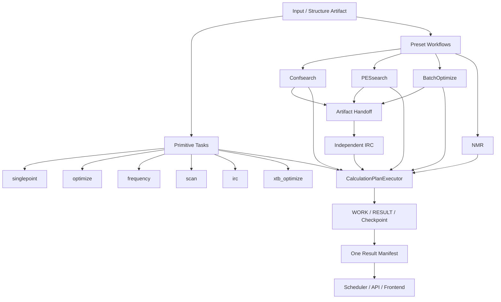

# ACP 计算工作流极简化重构与残留代码清理方案

状态：方案冻结版（Refactor Baseline）
适用版本：ACP v1.x → 极简计算架构
文档性质：计算工作流、调度、API、前端和历史兼容代码的唯一重构依据

> 本文档是代码重构方案，不是当前代码已经完成的状态说明。实施时应以本文档的任务分类、接口边界、删除矩阵和验收条件为准。

## 1. 目标与范围

本次重构的目标不是继续扩展“机制研究模块”，而是把 ACP 收敛为一个通用计算平台：

```text
基元计算能力
    ↓
通用计算计划
    ↓
预设工作流
    ↓
统一任务调度与结果清单
```

本方案解决以下问题：

1. 删除 S3/S4、Lowconfirm、Highconfirm 以及 MechanismStudy 的活动执行语义。
2. 删除 `optfreq`、`optfreqsp` 这类复合“简单计算”入口。
3. 将 Opt、Freq、SP、热化学统一为 BatchOptimize 的可组合步骤。
4. 将 IRC 固定为独立基元任务，不允许 BatchOptimize 执行或携带 IRC 配置。
5. 将 PESsearch 从机制研究代码中抽离为通用势能面搜索预设工作流。
6. 将同一类 QC 计算从多套引擎、Provider、Stage、Workflow 中收敛为一个执行器。
7. 将结果写入、任务恢复、结构来源和前端结果展示统一到一个协议。
8. 让旧任务可以只读查看，但不再允许旧机制代码创建新任务或继续扩张。

本方案不改变以下科学能力本身：

- Confsearch 的构象搜索协议；
- PESsearch 的坐标生成、扫描、路径筛选和 TS 猜测算法；
- ORCA/xTB 的底层 QC 接口；
- IRC 的 QC 执行和端点解析；
- BatchOptimize 的逐结构失败隔离、缓存和恢复；
- NMR、DP4/DP5 计算。

改变的是这些能力的归属、调用入口、数据模型、结果协议和调度方式。

## 2. 当前代码增量审计结论

截至本方案生成时，仓库可以观测到以下增量规模：

| 范围 | 新增内容 |
|---|---:|
| `origin/main..HEAD` 已提交分支 | 约 23,121 行 |
| 当前已修改文件 | 约 9,384 行 |
| 当前未跟踪源码、测试、文档（不含 `.omo`） | 约 7,461 行 |
| 合计新增量 | 约 39,966 行 |
| 当前 `src/acp/mechanism` | 61 个 Python 文件，约 28,145 行 |

这四万行并不全部是重复科学算法，主要混合了四种内容：

```text
真正需要保留的科学算法
    + 同一计算的多套执行实现
    + 阶段/项目/研究状态包装层
    + API、调度器、结果和前端的重复适配层
```

### 2.1 已确认的重复执行链

当前 Opt/Freq/SP/Thermo 至少同时出现在：

- `src/acp/workflows/simple.py`：`run_optfreq()`、`run_optfreqsp()`；
- `src/cccp/qc/interfaces/orca.py`：`opt_freq()`；
- `src/acp/mechanism/providers/native_refinement.py`：优化、频率、SP、热化学完整链；
- `src/acp/workflows/energy_shared.py`：旧能量交接链；
- `src/cccp/core/engine.py`：Dormant ConformerEngine 中的复合计算链；
- `src/acp/backends/batch.py`：批量 SP；
- `src/acp/mechanism/bond_scan.py`：扫描后自行逐帧 SP。

这些实现的差异主要是输入结构、方法参数和结果包装方式，不是独立科学任务。

### 2.2 已确认的阶段包装重复

当前实际调用链是：

```text
Lowconfirm / Highconfirm
        ↓
BatchConfirmEngine
        ↓
ConfirmEngine
        ↓
NativeRefinementProvider
        ↓
ORCA optimize / frequency / single_point
```

这说明现有 Batch 引擎并不是独立的通用计算引擎，而是旧 S3/S4 体系上的批量包装器。

### 2.3 已确认的协议重复

当前结果和模型至少分布于：

- `src/acp/mechanism/models.py`；
- `src/acp/mechanism/providers/contracts.py`；
- `src/acp/mechanism/batch_models.py`；
- `src/acp/mechanism/scan_models.py`；
- `src/acp/mechanism/refinement_manifest.py`；
- `src/acp/results/manifest.py`；
- `src/acp/storage/manifest.py`；
- `src/acp/mechanism/results_v2.py`；
- `src/acp/workflows/energy_shared.py` 的结果写入函数。

这些模块重复表达了 `Artifact`、`Provenance`、`Result`、`Manifest`、结构列表、能量和状态信息。

## 3. 冻结后的任务分类

### 3.1 基元任务

基元任务只表示一个可独立执行的计算能力：

| 工作流 ID | 含义 | 是否独立入口 |
|---|---|---:|
| `singlepoint` | 当前结构单点能 | 是 |
| `optimize` | 几何优化 | 是 |
| `frequency` | 频率计算 | 是 |
| `scan` | 约束/松弛扫描 | 是 |
| `irc` | TS 的正向/反向 IRC | 是 |
| `xtb_optimize` | xTB 几何优化 | 是 |

`thermochemistry` 可以是底层能力，但不作为当前 UI 的独立“简单计算”卡片；它由 BatchOptimize 的 `opt_freq_sp_thermo` 计划调用。

### 3.2 预设工作流

| 工作流 ID | 含义 | 输入 |
|---|---|---|
| `Confsearch` | 通用构象搜索与构象能量整理 | 分子输入 |
| `PESsearch` | 通用势能面搜索与候选结构生成 | 结构、反应物/产物或坐标计划 |
| `BatchOptimize` | 多结构批量优化及后处理 | 一个或多个结构 Artifact |
| `nmr` | 构象、GIAO、平均和 DP4/DP5 | 分子输入与实验谱 |

### 3.3 BatchOptimize 的唯一 profile 集合

```text
opt_only
opt_freq
opt_freq_sp
opt_freq_sp_thermo
```

BatchOptimize 可以接收普通最低点结构，也可以接收 TS 猜测结构。TS 与普通结构通过 `structure_role` 或 `optimization_mode` 区分，而不是通过 S3/S4 类区分。

BatchOptimize 明确不包含：

- IRC；
- endpoint 分类；
- 反应路径研究状态；
- review/promote；
- Lowconfirm/Highconfirm；
- S3/S4 结果清单。

### 3.4 IRC 的固定边界

IRC 是独立基元任务：

```text
输入：TS Artifact
执行：forward IRC + reverse IRC
输出：IRC Manifest、端点结构、解析报告
```

BatchOptimize 完成后，用户需要通过独立任务提交 IRC：

```text
BatchOptimize result
        ↓ 用户选择 TS
独立 IRC task
```

## 4. 修改后的极简架构



核心原则：

```text
Workflow 决定“做什么”
Plan 决定“按什么顺序做”
Executor 决定“如何执行”
Backend 决定“调用哪一个 QC 程序”
Manifest 决定“结果如何被发现”
```

API、CLI、Scheduler 和 Frontend 不应再自行实现计算逻辑。

## 5. 最终目录结构

目标目录如下：

```text
src/acp/
├── calculations/
│   ├── contracts.py
│   ├── plans.py
│   ├── executor.py
│   ├── primitives/
│   │   ├── singlepoint.py
│   │   ├── optimize.py
│   │   ├── frequency.py
│   │   ├── scan.py
│   │   ├── irc.py
│   │   └── thermochemistry.py
│   ├── pes/
│   │   ├── engine.py
│   │   ├── coordinates.py
│   │   ├── candidates.py
│   │   ├── path_selection.py
│   │   └── validation.py
│   └── batch/
│       ├── engine.py
│       ├── models.py
│       └── resume.py
├── confsearch/
├── nmr/
├── backends/
├── storage/
├── results/
├── workflows/
│   ├── registry.py
│   ├── simple.py
│   ├── confsearch.py
│   ├── pes_search.py
│   ├── batch_optimize.py
│   ├── irc.py
│   └── nmr.py
├── scheduler/
├── api/
├── cli.py
└── compat/
    └── legacy/
        ├── manifests.py
        ├── layouts.py
        └── read_only.py

src/acp/mechanism/  # 重构完成后从活动代码树删除
```

`cccp` 继续负责 QC 接口、输入解析和底层结果解析；`acp` 负责计算计划、预设工作流、任务生命周期和结果组织。

## 6. 统一计算契约

### 6.1 基础对象

只保留一套通用基础类型：

```text
StructureArtifact
CalculationRequest
CalculationStep
CalculationPlan
CalculationResult
ArtifactRef
Provenance
TaskManifest
Checkpoint
```

建议的职责：

| 类型 | 责任 |
|---|---|
| `StructureArtifact` | 结构路径、元素、角色、来源和候选 ID |
| `CalculationRequest` | 一个任务的输入、方法、资源和 workflow |
| `CalculationStep` | 一个可执行的原子操作 |
| `CalculationPlan` | 一组有序步骤及其依赖 |
| `CalculationResult` | 一个步骤的标准化结果 |
| `ArtifactRef` | 文件路径、类型、checksum、来源 |
| `Provenance` | backend、method、profile、版本、输入签名 |
| `TaskManifest` | 任务所有可展示结果的唯一索引 |
| `Checkpoint` | 恢复所需的内部状态，不承担结果展示职责 |

### 6.2 计划示例

```json
{
  "workflow": "BatchOptimize",
  "profile": "opt_freq_sp_thermo",
  "items": [
    {
      "id": "candidate_001",
      "role": "transition_state",
      "geometry": "input/ts_001.xyz"
    }
  ],
  "steps": [
    {"kind": "optimize", "mode": "transition_state"},
    {"kind": "frequency"},
    {"kind": "singlepoint"},
    {"kind": "thermochemistry"}
  ]
}
```

IRC 不能出现在上述计划中。IRC 请求单独存在：

```json
{
  "workflow": "irc",
  "input_artifact": "RESULT/structures/candidate_001.xyz",
  "input_role": "transition_state",
  "directions": ["forward", "reverse"]
}
```

### 6.3 一个 Executor

`CalculationPlanExecutor` 负责：

1. 校验计划；
2. 创建步骤目录；
3. 调用 backend capability；
4. 处理步骤间结构和能量交接；
5. 写入 checkpoint；
6. 记录错误和重试；
7. 写入唯一 `RESULT/result_manifest.json`。

它不识别以下概念：

```text
S1 / S2 / S3 / S4
Lowconfirm / Highconfirm
MechanismStudy / MechanismProject
review / promote
```

### 6.4 普通结构与 TS 的统一

不要再创建 `LowConfirmProfile`、`HighConfirmProfile` 或不同的 Refinement Engine。

只保留：

```text
structure_role = minimum | transition_state
optimization_mode = unconstrained | transition_state | constrained
```

TS 专用参数属于 `OptimizationSpec`，不是一个独立工作流。

## 7. 计算执行层重构

### 7.1 `simple.py`

保留：

```text
run_singlepoint
run_optimize
run_frequency
run_scan
run_irc
run_xtb_optimize
```

删除：

```text
run_optfreq
run_optfreqsp
```

简单工作流只负责把单个用户请求转换为一个最小 `CalculationPlan`，不重复实现路径、状态、结果和文件写入。

### 7.2 ORCA 接口

`cccp/qc/interfaces/orca.py` 继续保留真正的 QC 能力：

```text
optimize
transition_state_opt
frequency
single_point
constrained_optimize
relaxed_scan
irc
```

建议删除 `opt_freq()` 组合接口。组合由 ACP 的 `CalculationPlan` 表达，避免在 QC 接口层再维护一个隐藏的复合任务。

### 7.3 NativeRefinement 合并

`NativeRefinementProvider` 的有效部分迁移到：

```text
src/acp/calculations/batch/engine.py
```

可保留的内容：

- 普通结构/TS 的优化调用；
- rescue 策略；
- 频率判定；
- TS 虚频数量判定；
- 结果和 provenance 生成。

必须删除的内容：

- `s3`、`s4` profile 分支；
- `ConfirmEngine` 依赖；
- 机制研究状态写入；
- 内嵌 IRC；
- 与 `simple.py` 重复的结果序列化。

### 7.4 热化学合并

`providers/thermo.py`、`backends/external_backend.py`、`cccp/qc/runners/__init__.py` 中的 Shermo 调用应收敛为一个 `ThermochemistryCalculator`。

它只接受：

```text
frequency log
single-point energy
temperature
pressure
standard-state
```

热化学不能再由机制 Provider、旧 energy workflow 和 simple workflow 各自包装一套。

## 8. PESsearch 重构

PESsearch 是通用预设工作流，不是 MechanismStudy 的阶段。

### 8.1 保留的科学能力

以下能力应迁移到 `src/acp/calculations/pes/`：

- bond-length / coordinate plan 生成；
- relaxed scan；
- scan trajectory 整理；
- energy profile 计算；
- path selection；
- geometry guard；
- scan rescue；
- TS guess / intermediate candidate 筛选；
- 可选的 reaction input atom mapping。

### 8.2 合并的重复能力

`bond_scan.py`、`native_peb.py`、`guided_scan.py` 中的逐帧 SP、缓存、失败处理必须调用统一的 `BatchSinglePointExecutor`，不得各自维护循环。

结果链应变为：

```text
scan frames
    ↓
BatchSinglePointExecutor
    ↓
EnergyProfile
    ↓
CandidateSelector
    ↓
PESsearch result manifest
```

### 8.3 PESsearch 输出

PESsearch 只输出通用候选结构 Artifact：

```text
RESULT/structures/<candidate_id>.xyz
RESULT/pes_search/pes_profile.json
RESULT/result_manifest.json
```

不再输出：

```text
s2_path_manifest.json
s2_candidate_manifest.json
mechanism_study/<study_id>/
```

如果旧任务仍需读取 S2 文件，读取逻辑只能位于 `compat/legacy`。

## 9. IRC 重构

### 9.1 活动模块

```text
src/acp/calculations/primitives/irc.py
src/acp/workflows/irc.py
```

### 9.2 可复用的底层代码

可以复用：

- `cccp/qc/interfaces/orca.py` 的 IRC 执行；
- `cccp/qc/interfaces/orca_ts.py` 的 IRC 结果解析；
- 当前 endpoint 几何分类算法。

### 9.3 必须移除的耦合

以下依赖必须消失：

```text
ConfirmEngine → IRC
LowConfirmProfile.run_irc
HighConfirmProfile.run_irc
EndpointProvider.run_irc
MechanismStudy → IRC
S3/S4 manifest → IRC
```

端点分析可以作为 IRC 内部的后处理步骤，但不能把它重新包装成机制阶段。

## 10. 结果和存储协议

### 10.1 唯一结果索引

每个任务只允许新写入：

```text
RESULT/result_manifest.json
```

它登记：

- 结构；
- 能量；
- 频率；
- 热化学报告；
- PES profile；
- IRC endpoint；
- 可视化文件；
- provenance。

### 10.2 唯一恢复文件

```text
WORK/00_RUNTIME/checkpoint.json
```

批量任务的 item 状态、cache key、失败信息和恢复位置写入 checkpoint，不再把 batch manifest 当作结果索引。

### 10.3 统一目录

```text
<task_root>/
├── WORK/
│   ├── 00_RUNTIME/
│   │   ├── checkpoint.json
│   │   └── events.jsonl
│   ├── 03_OPT/
│   ├── 04_FREQ/
│   ├── 05_SP/
│   ├── 06_THERMO/
│   └── 07_PATH/
├── RESULT/
│   ├── structures/
│   ├── energies/
│   ├── frequencies/
│   ├── thermochemistry/
│   ├── pes_search/
│   ├── irc/
│   └── result_manifest.json
├── input.xyz
├── task.json
└── job.json
```

步骤目录是执行实现，不是新的用户工作流分类。

### 10.4 历史结果

旧文件可以被兼容读取：

```text
s2_path_manifest.json
s3_lowconfirm_manifest.json
s4_highconfirm_manifest.json
result_summary.json
refinement_manifest.json
```

但新代码不允许写入这些格式。历史解析器放入：

```text
src/acp/compat/legacy/manifests.py
```

## 11. 残留代码清理矩阵

### 11.1 迁移后删除的活动模块

以下模块属于旧研究项目或阶段编排，不应继续保留活动执行能力：

```text
src/acp/mechanism/orchestrator.py
src/acp/mechanism/study_runner.py
src/acp/mechanism/project.py
src/acp/mechanism/chain.py
src/acp/mechanism/engines/
src/acp/mechanism/modules/
src/acp/mechanism/stages/confirm.py
src/acp/mechanism/stages/low_confirm.py
src/acp/mechanism/stages/high_confirm.py
src/acp/mechanism/stages/handoff.py
src/acp/mechanism/results_v2.py
```

删除条件不是“当前测试没有报错”，而是：

1. 新工作流已经改用 `CalculationPlanExecutor`；
2. API、CLI、Scheduler 和 Frontend 已无活动引用；
3. 历史读取已迁移到 `compat/legacy`；
4. 旧行为测试已经被能力测试替换。

### 11.2 合并后删除原文件

| 当前模块 | 迁移目标 | 原模块处理 |
|---|---|---|
| `mechanism/batch_confirm.py` | `calculations/batch/engine.py` | 合并后删除 |
| `mechanism/batch_models.py` | `calculations/batch/models.py` | 合并后删除 |
| `mechanism/providers/native_refinement.py` | `calculations/batch/engine.py` | 删除旧 Provider |
| `mechanism/providers/thermo.py` | `calculations/primitives/thermochemistry.py` | 删除旧 Provider |
| `mechanism/bond_scan.py` | `calculations/pes/scan.py` | 删除旧入口 |
| `mechanism/scan_models.py` | `calculations/pes/contracts.py` | 合并后删除 |
| `mechanism/scan_manifest.py` | `results/manifest.py` 或 PES 报告 | 删除旧 Manifest writer |
| `mechanism/primitives/path_selector.py` | `calculations/pes/path_selection.py` | 移动后删除旧路径 |
| `mechanism/primitives/path_profile.py` | `calculations/pes/path_analysis.py` | 移动后删除旧路径 |
| `mechanism/primitives/scan_trajectory.py` | `calculations/pes/scan.py` | 合并后删除 |
| `mechanism/primitives/scan_rescue.py` | `calculations/pes/validation.py` | 合并后删除 |
| `mechanism/primitives/geometry_guard.py` | `calculations/pes/validation.py` | 合并后删除 |
| `mechanism/identity.py` | `calculations/irc/validation.py` 或通用质量检查 | 删除机制命名 |
| `mechanism/layout.py` | `storage/layout.py` 或 compat | 删除 mechanism layout |
| `mechanism/_helpers.py` | `acp/utils/`、`storage/` | 拆分后删除 |

### 11.3 有价值但必须改名和脱离机制命名的代码

以下算法不要因为当前位于 `mechanism` 目录而直接删除：

- 原子映射；
- bond change 推断；
- path profile；
- geometry guard；
- scan rescue；
- TS identity / 虚频校验；
- native PEB/PES 路径算法。

它们应当被迁移到 `calculations/pes` 或 `calculations/irc`，并删除以下语义：

```text
study
stage
promotion
review gate
S2/S3/S4
mechanism project
```

### 11.4 需要重点审查的旧代码

#### `cccp/core/engine.py`

该模块是 Dormant ConformerEngine，内部仍有构象、优化、频率、SP、热化学和旧状态管理。应执行：

1. 用 import graph 确认 `acp/confsearch` 是否仍依赖它；
2. 如果不依赖，整个模块删除；
3. 如果仍有局部解析能力，抽取到 `cccp/qc` 或 `acp/confsearch/shared` 后删除 Engine 本身。

#### 旧工作流

以下工作流已经被 Confsearch v1 取代：

```text
src/acp/workflows/ensemble.py
src/acp/workflows/energy.py
src/acp/workflows/xtbmd_censo_energy.py
```

它们不应继续保留完整执行实现。建议只保留历史配置到新 Confsearch 的只读映射；新任务不得执行旧代码。

#### RPH 适配器

`providers/rph_adapter.py` 属于历史 parity 实现。若没有活动生产任务要求运行 RPH，应删除运行时适配器；如必须查看历史数据，只保留只读解析器，不能保留 Provider 接口和执行路径。

## 12. Catalog、CLI、Scheduler、API 和前端清理

### 12.1 Catalog

`WORKFLOW_CATALOG` 只保留：

```text
singlepoint
optimize
frequency
scan
irc
xtb_optimize
Confsearch
PESsearch
BatchOptimize
nmr
```

旧 ID 可以进入 `status: retired`，但不得进入：

- 新建任务下拉框；
- CLI handler；
- scheduler plan provider；
- 前端工作流卡片；
- 新任务 schema。

### 12.2 Scheduler

删除以下阶段特定 Provider：

```text
_PesSearchStagePlanProvider
_LowConfirmStagePlanProvider
_HighConfirmStagePlanProvider
_OptfreqStagePlanProvider
_OptfreqspStagePlanProvider
```

替换为：

```text
Catalog entry
    ↓
PlanCompiler
    ↓
generic StageTask / CalculationStep
```

Scheduler 只识别：

```text
workflow
step
artifact
capability
resource
retry
checkpoint
```

Scheduler 不识别：

```text
S3 / S4
Lowconfirm / Highconfirm
mechanism_project_id
study phase
```

### 12.3 API

删除新任务 API 中的：

```text
mechanism-studies
mechanism-projects
reaction preview/confirm
reviews
promote
mechanism resume
mechanism_project_id
```

改为统一的：

```text
POST /jobs
GET /jobs/{id}
POST /jobs/{id}/pause
POST /jobs/{id}/continue
POST /jobs/{id}/rerun
POST /jobs/{id}/purge
GET /jobs/{id}/artifacts
POST /jobs/{id}/artifacts/{artifact_id}/run-irc
```

旧机制 API 若需要保留，只能放入只读兼容路由，并明确禁止创建、恢复和晋级。

### 12.4 前端

简单计算卡片：

```text
单点
几何优化
频率
扫描
IRC
xTB 优化
```

预设工作流卡片：

```text
构象搜索
势能面搜索
批量优化
NMR
```

BatchOptimize 页面内部选择 profile，不生成四张独立卡片。

删除：

```text
阶段工作流区域
S1-S4 时间线
Mechanism Project 面板
Review / Promote 按钮
Lowconfirm / Highconfirm 选择器
```

前端工作流列表必须来自 Catalog，不再维护 `STAGE_WORKFLOW_IDS` 等硬编码数组。

## 13. 数据库和历史兼容策略

### 13.1 新数据库模型

新任务只需要通用字段：

```text
job
workflow
request_json
work_dir
status
attempts
continued_from
result_manifest_path
created_at
updated_at
```

不再新增：

```text
mechanism_study_id
mechanism_project_id
stage S1-S4
review decision
promotion state
```

### 13.2 历史表

历史 `mechanism_studies`、`mechanism_projects`、`decision_points` 表不立即破坏；处理方式为：

1. 停止新写入；
2. 停止新任务依赖；
3. 提供只读投影；
4. 后续通过归档迁移删除活动查询代码。

不允许为了“兼容”继续保留整套旧 Orchestrator。

## 14. 测试重构

### 14.1 测试按能力重命名

将测试从：

```text
test_acp_mechanism_study.py
test_acp_mechanism_stages.py
test_acp_mechanism_project.py
test_acp_mechanism_modules.py
```

迁移为：

```text
test_calculation_executor.py
test_batch_optimize.py
test_pes_search.py
test_irc.py
test_result_manifest.py
test_legacy_read_only.py
```

### 14.2 必须保留的科学测试

- PES 坐标生成和路径选择；
- 扫描能量 profile；
- TS 虚频判定；
- 普通结构虚频失败判定；
- BatchOptimize 混合 TS/INT；
- 单 item 失败不影响其他 item；
- checkpoint 恢复和 cache key；
- IRC 正反向输出和端点解析；
- 热化学输入完整性；
- 结果 Artifact 注册。

### 14.3 必须新增的架构测试

```text
BatchOptimize schema 拒绝 irc 字段
BatchOptimize manifest 不含 IRC product
IRC schema 只接受 TS Artifact
optfreq 不在 active catalog
optfreqsp 不在 active catalog
Lowconfirm 不在 active catalog
Highconfirm 不在 active catalog
新代码不写 s3/s4 manifest
所有新结果都注册到 result_manifest.json
legacy manifest 只能读取不能写入
```

## 15. 分阶段实施顺序

### Wave 0：冻结和盘点

- 为当前工作区建立 checkpoint 分支或标签；
- 不执行 destructive reset；
- 保存当前测试基线；
- 输出 import graph；
- 标记所有旧工作流的生产引用；
- `.omo/` 等运行时文件不纳入重构提交。

交付物：依赖清单、删除清单、测试基线、旧结果样例。

### Wave 1：统一契约和结果层

- 建立 `calculations/contracts.py`；
- 建立 `CalculationPlan`；
- 统一 `ResultManifest` 写入；
- 统一 checkpoint；
- 暂不删除旧模块，只让新代码使用新契约。

### Wave 2：统一基础计算执行器

- 迁移 singlepoint、optimize、frequency、thermochemistry；
- 让 simple workflow 变成薄适配器；
- 删除重复的结果写入和状态处理；
- 逐步停用 ORCA `opt_freq()`。

### Wave 3：重写 BatchOptimize

- 将 BatchConfirmEngine 改为 BatchOptimizeEngine；
- 将 NativeRefinement 的有效算法并入通用 executor；
- 实现四个 profile；
- 删除 S3/S4 profile；
- 增加 BatchOptimize 无 IRC 架构测试。

### Wave 4：独立 IRC

- 实现独立 `irc` workflow；
- 迁移 ORCA IRC 和 endpoint 分析；
- 从所有 Batch、Confirm、Stage、Mechanism contract 中删除 IRC；
- 独立写入 `RESULT/irc/`。

### Wave 5：迁移 PESsearch

- 将 PES 算法迁移到 `calculations/pes`；
- 统一扫描后 SP；
- 统一候选 Artifact；
- 取消 S2 manifest 作为新协议；
- 删除机制路径目录。

### Wave 6：清理 Catalog、Scheduler、CLI

- 删除 `optfreq`、`optfreqsp` 活动入口；
- 删除 Lowconfirm、Highconfirm；
- 用 PlanCompiler 替换专用 StagePlanProvider；
- 删除 scheduler 的机制特判。

### Wave 7：清理 API、数据库、前端

- 切断 MechanismProject 新写入；
- 清理机制 API schema；
- 前端只读取 Catalog；
- 将旧任务转为只读详情。

### Wave 8：删除源代码和兼容层收口

- 将历史读取器放入 `compat/legacy`；
- 删除旧机制源代码；
- 删除旧测试；
- 删除旧文档中的活动设计；
- 执行全仓库 grep、ruff、mypy 和完整测试。

## 16. 删除前的依赖验证

每个待删除模块必须先通过以下检查：

```powershell
rg -n "from acp\.mechanism|import acp\.mechanism|mechanism\." src tests
rg -n "Lowconfirm|Highconfirm|S3|S4|mechanism_project_id|MechanismProject" src tests frontend
rg -n "run_optfreq|run_optfreqsp|optfreqsp|optfreq" src tests frontend
```

删除前将命中分为：

```text
active import       → 必须迁移
legacy reader       → 移入 compat
test-only reference → 重写或删除
documentation       → 更新或归档
string in historical fixture → 保留并标注历史
```

不得仅通过改名来规避 grep。新目录中也不应继续出现旧阶段语义。

## 17. 最终验收条件

### 17.1 活动工作流

活动 Catalog 只能包含：

```text
singlepoint
optimize
frequency
scan
irc
xtb_optimize
Confsearch
PESsearch
BatchOptimize
nmr
```

### 17.2 BatchOptimize 不变量

```text
BatchOptimize request 不允许 irc
BatchOptimize plan 不允许 irc step
BatchOptimize result 不产生 IRC artifact
BatchOptimize 不依赖 EndpointProvider
BatchOptimize 不依赖 MechanismProject
BatchOptimize 不出现 S3/S4 profile
```

### 17.3 计算实现数量

目标是每类实际 QC 操作只保留一套 ACP 调度实现：

```text
optimize        1 套
frequency       1 套
singlepoint     1 套
thermochemistry 1 套
scan            1 套统一调度
irc             1 套独立任务
```

QC backend 可以有 ORCA、xTB 等多个实现，但不能再有多套相同 workflow executor。

### 17.4 结果协议

新任务必须满足：

```text
一个 task root
一个 checkpoint
一个 result_manifest
一个 artifact handoff 规则
```

### 17.5 代码依赖

活动代码中不得再出现：

```text
StudyOrchestrator
MechanismProjectStore
LowConfirmProfile
HighConfirmProfile
run_low_confirm
run_high_confirm
run_optfreq
run_optfreqsp
mechanism_project_id
```

`irc` 可以出现在独立 IRC 模块中，但不能出现在 BatchOptimize 的 request、plan、profile 和 executor 中。

## 18. 清理规模预估

在不删除有效 PES、Confsearch、IRC 和 BatchOptimize 科学算法的前提下，预计可清理：

| 区域 | 预计可回收内容 |
|---|---:|
| 旧 mechanism orchestration、project、stage、module | 8,000–12,000 行 |
| 重复计算执行和 Provider 包装 | 3,000–6,000 行 |
| 重复 manifest、结果转换和 storage 适配 | 2,000–4,000 行 |
| 重复 API、Scheduler、CLI 分支 | 2,000–4,000 行 |
| 重复测试、前端状态和旧文档 | 8,000–14,000 行 |
| 总计 | 约 23,000–40,000 行 |

最终代码量不应以“保留所有历史文件”为目标，而应以以下指标为目标：

```text
一个通用执行器
四个 BatchOptimize profile
一个 IRC 独立任务
一个结果清单
一个 Catalog
一个计划编译器
零个活动 S3/S4 阶段
零个活动 MechanismProject
```

## 19. 定义完成（Definition of Done）

只有同时满足以下条件，才认为本轮重构完成：

1. UI 中没有“阶段工作流”、Lowconfirm、Highconfirm 和 S1-S4；
2. `optfreq`、`optfreqsp` 不再作为活动任务；
3. BatchOptimize 可以覆盖优化、频率、单点和热化学的所有组合；
4. IRC 可以从任意已完成 TS Artifact 独立提交；
5. BatchOptimize 与 IRC 没有代码级依赖；
6. PESsearch、BatchOptimize 和 IRC 都能独立运行、暂停、继续和查看结果；
7. 新任务只写统一结果协议；
8. 历史任务仍可只读查看；
9. 旧机制代码不再被活动模块 import；
10. 完整测试、静态检查和远程/本地执行一致性验证通过。
