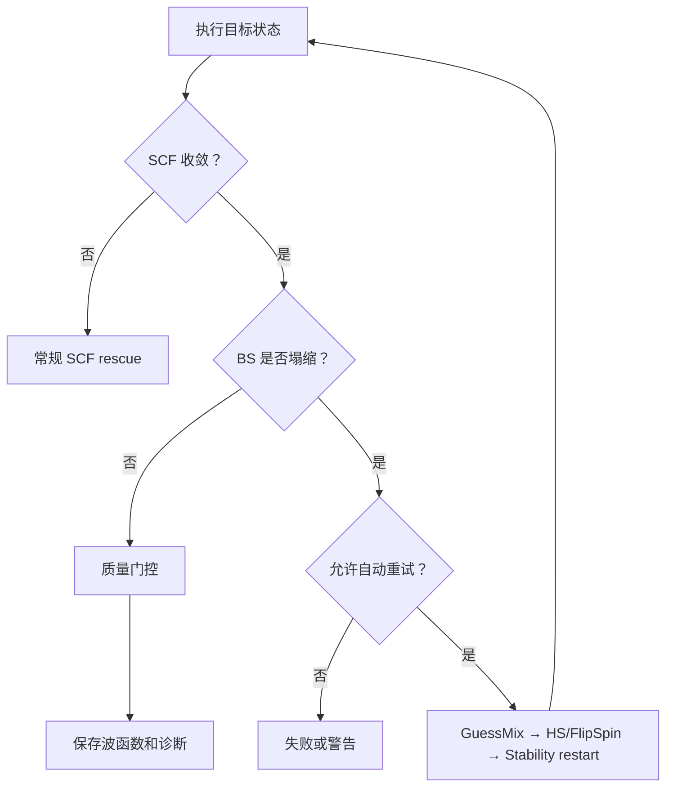

# ACP 电子态、自旋极化单重态与 CASSCF 能力设计

**状态：** 设计提案（仅设计，不包含实现）  
**适用版本：** ACP post-refactor calculation-plan architecture  
**日期：** 2026-09-06  
**主要后端：** ORCA 6.1+  

## 1. 背景与目标

ACP 当前以 `charge + multiplicity` 描述计算对象的电子态。这足以覆盖普通闭壳层分子和多数常规自由基，但不足以无歧义表达以下任务：

- 强制 restricted 或 unrestricted 的单重态、双重态、三重态及更高自旋态；
- broken-symmetry open-shell singlet（BS-OSS，自旋极化单重态）；
- 从高自旋参考波函数构造反铁磁耦合的低自旋态；
- 同一结构上批量比较 singlet/triplet/quintet 等多自旋态；
- 在 OPT → FREQ → SP 链中保持同一个电子态和波函数分支；
- 对关键结构执行 CASSCF，并可选以 NEVPT2 补充动态相关；
- 将 `<S²>`、局部自旋密度、稳定性、自然轨道占据数等电子结构证据纳入标准结果。

本设计的目标是：

1. 在每一个具体计算协议的界面中，以一个完整的“高级电子态与自旋配置”模块呈现相关设置。
2. 同一模块同时覆盖普通多自旋体系和 BS-OSS，不为每类自旋问题建立独立工作流。
3. 支持内置预设、用户模板、复制到其他计算阶段，以及 JSON/YAML 导入导出，便于在不同分子和协议之间快速复用。
4. 最大化复用现有 `CalculationPlan`、计算基元、backend capability、BatchOptimize、catalog 动态表单及 `result_manifest.json`。
5. 仅新增一个必要的计算实现模块：`src/acp/calculations/primitives/casscf.py`。

## 2. 设计结论

整体能力拆分为两个正交部分：

- **电子态模块 `electronic_state`：** 作为所有量化计算 level 的通用高级配置，可应用于 OPT、SP、FREQ、TS、IRC、scan 和 CASSCF。
- **CASSCF 基元：** 作为新的 `StepKind.CASSCF`，用于关键结构的多参考诊断和 CASSCF/NEVPT2 能量计算。

不新增 `BSWorkflow`、`OpenShellWorkflow` 或 `MultiSpinWorkflow`。单态任务、多自旋扫描和 BS-OSS 仅是同一个电子态模块的不同“状态方案”。


## 3. 核心术语与语义

### 3.1 目标态与 ORCA 输入参考态必须分离

对普通计算，目标多重度和 ORCA 坐标行多重度相同。但对于从 triplet 初猜构造 BS singlet 的 `FlipSpin` 路径：

- 目标物理态是 singlet，`target_multiplicity = 1`；
- ORCA 先收敛 high-spin triplet，输入参考多重度是 `reference_multiplicity = 3`；
- 随后翻转指定原子上的自旋并以 `FinalMs = 0` 收敛 BS determinant。

因此现有单一 `multiplicity` 字段不能继续同时表示这两种含义。

### 3.2 Unrestricted 是后端无关术语

ACP 合同和界面使用 `restricted/unrestricted`。ORCA renderer 再将 unrestricted HF/DFT 统一映射为 `%scf HFTyp UHF`。界面不使用一个含义模糊的 `UHF` 复选框。

### 3.3 电子自旋对称性与几何点群对称性分离

BS 表示 α/β 轨道和自旋密度的对称性破缺；`UseSym/NoUseSym` 控制的是分子点群。两者必须使用不同字段：

- `spin_mode = broken_symmetry`
- `spatial_symmetry = auto | disable | preserve`

### 3.4 Stability 是单点诊断

ORCA 6.1 的 SCF stability analysis 只支持 single-point-like calculation。OPT 或 FREQ 需要稳定性检查时，ACP 应在目标几何上创建独立的内部 SP 诊断任务，不能把 `STABPerform` 直接塞进优化或频率输入。

## 4. 协议级高级模块

### 4.1 在 catalog 中的表现

继续以 `src/acp/catalog.py` 作为界面字段、默认值、选项和 profile 的单一权威来源。为通用表单增加一个复合字段类型：

```python
FIELD_DEFINITIONS["electronic_state"] = {
    "type": "module",
    "renderer": "electronic_state",
    "label": "Electronic State and Spin",
    "label_zh": "电子态与自旋",
    "advanced": True,
    "schema_version": 1,
    "default": {"*": {"mode": "automatic"}},
}
```

需要支持电子态配置的 method level 只需声明：

```python
{
    "level_id": "optimize",
    "fields": [
        "functional",
        "basis",
        "solvent_model",
        "solvent",
        "electronic_state",
    ],
}
```

首期挂载范围：

| 协议/level | 是否显示 | 说明 |
|---|---:|---|
| `dft_singlepoint.single_point` | 是 | 支持普通开壳层、BS、稳定性诊断 |
| `dft_optimize.optimize` | 是 | 支持态保持和优化后诊断 |
| `dft_frequency.frequency` | 是 | 优先继承 OPT 波函数 |
| `batch_optimize.batch` | 是 | 提供 job 默认、逐结构覆盖和多态展开 |
| `irc` | 是 | 默认继承 TS 的已确认电子态 |
| `scan` | 是 | BS 时逐帧独立运行，禁用单输入 FlipSpin 参数扫描 |
| `casscf.casscf` | 是 | 目标 multiplicity、roots 与 state average 联动 |
| xTB level | 条件显示 | 仅显示后端确实支持的字段，不呈现 ORCA 专属 BS 选项 |

### 4.2 界面布局

高级区域内呈现一个独立卡片，而不是把字段平铺在现有两列表单中。

```text
┌─ 电子态与自旋（高级） ─────────────────────────────┐
│ 当前摘要：BS 单重态 · Triplet→FlipSpin · 1 个状态    │
│                                                     │
│ [自动] [闭壳层] [普通开壳层] [BS 单重态] [多自旋]   │
│                                                     │
│ 状态方案                                             │
│ ┌────────┬────┬────────────┬─────────┬──────────┐   │
│ │ 名称   │Mult│自旋模式    │初猜策略 │应用范围  │   │
│ │ BS-S1  │ 1  │BS          │FlipSpin │全部结构  │   │
│ │ T1     │ 3  │Unrestricted│Default  │全部结构  │   │
│ └────────┴────┴────────────┴─────────┴──────────┘   │
│ [+ 添加状态] [从预设载入] [保存为模板] [导入/导出]   │
│                                                     │
│ ▸ BS 构造与初始轨道                                  │
│ ▸ 波函数继承与收敛                                   │
│ ▸ 稳定性和质量门控                                   │
│ ▸ 分阶段覆盖                                         │
└─────────────────────────────────────────────────────┘
```

卡片折叠时也必须显示摘要，避免用户忘记当前协议正在执行高成本的多自旋或 BS 计算。

### 4.3 顶层模式

| UI 模式 | 产生的状态方案 | 主要用途 |
|---|---|---|
| 自动 | 一个 `spin_mode=auto` 方案 | 保持现有行为 |
| 闭壳层 | 一个 restricted 方案 | RKS/RHF singlet |
| 普通开壳层 | 一个 unrestricted 方案 | doublet、triplet 等 |
| BS 单重态 | 一个 target singlet + high-spin reference 方案 | 自旋极化单重态 |
| 多自旋 | 两个或以上状态方案 | singlet/triplet/quintet 比较 |

模式按钮只是便捷入口，最终均序列化为统一的 `states[]` 列表。

## 5. 电子态数据合同

### 5.1 协议配置结构

建议将电子态模块存放在具体 method level 内：

```yaml
method:
  schema_version: 1
  profile_id: custom
  levels:
    optimize:
      engine: orca
      functional: wB97X-D4
      basis: def2-SVP
      electronic_state:
        schema_version: 1
        execution_mode: single
        default_state_id: bs_s1
        states:
          - state_id: bs_s1
            label: BS singlet
            target_multiplicity: 1
            spin_mode: broken_symmetry
            guess:
              strategy: flipspin
              reference_multiplicity: 3
              final_ms: 0.0
              flip_atoms: [17]
              atom_index_base: 1
            spatial_symmetry: disable
            wavefunction:
              source: auto
              inherit_between_steps: true
            diagnostics:
              population: loewdin
              stability: final_geometry
              write_spin_density: true
            quality_gate:
              collapse_policy: error
              s2_min: 0.1
              s2_max: 1.5
              require_opposite_spin_centers: true
```

### 5.2 状态方案 `ElectronicStateSpec`

建议在 `src/acp/calculations/contracts.py` 定义不可变合同：

```python
@dataclass(frozen=True, slots=True)
class ElectronicStateSpec:
    state_id: str
    label: str = ""
    target_multiplicity: int = 1
    spin_mode: SpinMode = SpinMode.AUTO
    guess: GuessSpec = field(default_factory=GuessSpec)
    spatial_symmetry: SpatialSymmetryMode = SpatialSymmetryMode.AUTO
    wavefunction: WavefunctionPolicy = field(default_factory=WavefunctionPolicy)
    diagnostics: SpinDiagnosticsSpec = field(default_factory=SpinDiagnosticsSpec)
    quality_gate: SpinQualityGate = field(default_factory=SpinQualityGate)
```

子合同可以仍位于同一个 `contracts.py`，不需要为每个配置对象新增模块。

### 5.3 初猜合同 `GuessSpec`

```python
@dataclass(frozen=True, slots=True)
class GuessSpec:
    strategy: GuessStrategy = GuessStrategy.DEFAULT
    reference_multiplicity: int | None = None
    final_ms: float | None = None
    flip_atoms: tuple[int, ...] = ()
    atom_index_base: Literal[0, 1] = 1
    guess_mix_angle: float = 45.0
    orbital_source: Path | None = None
    broken_sym_na: int | None = None
    broken_sym_nb: int | None = None
```

支持的策略：

| 策略 | UI 名称 | ORCA 行为 | 适用场景 |
|---|---|---|---|
| `default` | 默认初猜 | ORCA 默认 | 普通闭壳层/高自旋态 |
| `guessmix` | HOMO/LUMO 混合 | `GuessMix angle` | 简单双自由基快速尝试 |
| `flipspin` | 高自旋局部翻转 | `FlipSpin` + `FinalMs` | 推荐的 BS 构造方式 |
| `broken_sym` | 双中心 BrokenSym | `BrokenSym NA,NB` | 明确的两磁中心模型 |
| `moread` | 读取已有轨道 | `MORead` + `%moinp` | 延续已确认波函数 |
| `stability_restart` | 稳定性重启 | stability 产生的新轨道 | 从不稳定 RKS/UKS 解继续 |

### 5.4 波函数继承策略

```yaml
wavefunction:
  source: auto                  # auto | regenerate | artifact | none
  artifact_path: null
  inherit_between_steps: true
  on_incompatible_basis: regenerate
  require_same_state_signature: true
```

`state_signature` 至少包含：

- charge；
- target/reference multiplicity；
- spin mode；
- guess strategy；
- flip atoms；
- method/basis；
- relevant SCF settings。

只有 signature 兼容时才可自动读取上一阶段 `.gbw`。

## 6. 内置预设与快速复用

### 6.1 内置电子态预设

预设由 catalog 提供，只包含电子态模块，不绑定具体泛函、基组或溶剂：

| preset_id | 内容 |
|---|---|
| `auto_ground_state` | 当前 ACP 默认行为 |
| `closed_shell_singlet` | restricted singlet |
| `unrestricted_doublet` | unrestricted doublet |
| `unrestricted_triplet` | unrestricted triplet |
| `bs_singlet_guessmix` | UHF/UKS singlet + GuessMix |
| `bs_singlet_flipspin` | triplet reference → FlipSpin → `FinalMs=0` |
| `singlet_triplet_pair` | singlet + triplet 两态比较 |
| `bs_singlet_triplet_pair` | BS singlet + triplet，并建立波函数依赖 |
| `spin_ladder_1_3_5` | singlet/triplet/quintet 状态集合 |

预设载入后生成独立副本，用户修改不得反向改变 catalog 内置值。

### 6.2 用户模板

界面提供：

- 保存为电子态模板；
- 覆盖已有模板；
- 复制到当前协议的其他 level；
- 复制到选中的 Batch items；
- 导出 JSON/YAML；
- 从 JSON/YAML 导入。

首期可将用户模板保存在浏览器本地存储中，避免新增后端存储模块。每次提交时必须把完整展开后的配置嵌入 `method_config.json`、`job.json` 和 provenance；运行结果绝不能依赖浏览器中仍然存在同名模板。

模板建议采用稳定的 envelope：

```json
{
  "kind": "acp.electronic_state_preset",
  "schema_version": 1,
  "preset_id": "bcb_bs_protocol",
  "label": "BCB BS singlet / triplet",
  "electronic_state": {}
}
```

后续若需要跨设备共享，可将同一 envelope 接入通用 ACP preset API；不应改变任务内的电子态合同。

### 6.3 阶段继承

OPT、FREQ 和 SP 的电子态默认采用：

```text
协议默认 → level 覆盖 → Batch item 覆盖 → state 方案
```

界面提供以下应用方式：

- 所有阶段使用相同电子态；
- FREQ 继承 OPT；
- SP 继承 OPT，但允许更换方法/基组后的初猜策略覆盖；
- 每阶段独立配置。

默认推荐“所有阶段继承 + 保持波函数”。

## 7. 多自旋体系

### 7.1 统一为状态方案列表

多自旋计算不建立另一套配置。示例：

```yaml
electronic_state:
  execution_mode: state_sweep
  states:
    - state_id: s1_closed
      label: Closed-shell singlet
      target_multiplicity: 1
      spin_mode: restricted
    - state_id: s1_bs
      label: BS singlet
      target_multiplicity: 1
      spin_mode: broken_symmetry
      guess:
        strategy: flipspin
        reference_multiplicity: 3
        final_ms: 0
        flip_atoms: [17]
    - state_id: t1
      label: Triplet
      target_multiplicity: 3
      spin_mode: unrestricted
    - state_id: q1
      label: Quintet
      target_multiplicity: 5
      spin_mode: unrestricted
```

### 7.2 展开规则

对 `N` 个结构和 `M` 个状态，执行层展开为最多 `N × M` 个状态分支：

```text
candidate_001
├─ state_s1_closed
├─ state_s1_bs
├─ state_t1
└─ state_q1
```

每个状态分支内部仍按 OPT → FREQ → SP 串行执行，以保持波函数连续；不同结构和互不依赖的状态分支可并行。

### 7.3 状态依赖

BS singlet 可声明依赖 triplet：

```yaml
dependencies:
  - state_id: s1_bs
    reference_state_id: t1
    artifact: optimized_wavefunction
```

若用户只选择 BS singlet 而未显式加入 triplet，执行器可创建一个内部 `reference_only` 高自旋 SP/OPT bootstrap。该内部步骤必须显示在任务详情和 provenance 中，不能成为不可见计算。

### 7.4 相对能量比较

结果聚合层按共同几何语义和计算级别生成：

- `ΔE(state)`；
- `ΔG(state)`，仅当各状态均有兼容的频率和热化学校正；
- singlet-triplet gap；
- BS-triplet energy difference；
- 可选 Yamaguchi/Noodleman 投影值。

投影能量只能标记为派生诊断，不能覆盖原始 BS 能量，也不能默认充当最终 benchmark。

## 8. BatchOptimize 集成

### 8.1 两级配置

BatchOptimize 保留 job-level 默认，并允许逐结构覆盖：

```yaml
input:
  charge: 0
  multiplicity: 1
  electronic_state:                   # job 默认
    preset_id: singlet_triplet_pair
  items:
    - item_id: ts_d1
      tag: TS
      electronic_state_override:
        preset_id: bs_singlet_triplet_pair
        states:
          - state_id: s1_bs
            guess:
              flip_atoms: [12]
    - item_id: ionic_ts
      tag: TS
      electronic_state_override:
        preset_id: closed_shell_singlet
```

### 8.2 Batch 界面

Batch 表格增加“电子态”列，默认只显示摘要：

```text
TS_D1     TS    q=0    BS-S1 + T1    [配置]
INT_DR    INT   q=0    BS-S1 + T1    [配置]
TS_ZW     TS    q=0    RKS-S1        [配置]
```

批量操作包括：

- 将协议默认应用到所有结构；
- 仅应用到选中结构；
- 复制上一行配置；
- 为所有 TS/INT 分别设置模板；
- 检查各行 `flip_atoms` 是否在该结构的原子范围内；
- 在提交前显示实际任务展开数及资源估算。

### 8.3 缓存与续算

以下内容必须进入 batch item cache key 和 plan fingerprint：

- 规范化后的完整电子态模块；
- 状态方案顺序和 `state_id`；
- 初猜策略、参考多重度和 flip atoms；
- stability 与质量门控；
- 波函数来源 checksum；
- CASSCF active space（若适用）。

RKS、普通 UKS、BS-UKS 和不同 FlipSpin 原子集合之间严禁复用缓存。

每个状态分支独立 checkpoint。一个状态失败不应抹除同一结构上已经完成的其他状态。

## 9. ORCA 输入映射

### 9.1 普通 closed-shell singlet

```yaml
target_multiplicity: 1
spin_mode: restricted
```

对应 RKS/RHF，不产生 BS 关键词。

### 9.2 普通 unrestricted triplet

```yaml
target_multiplicity: 3
spin_mode: unrestricted
```

```text
%scf
  HFTyp UHF
end
* xyz 0 3
```

### 9.3 GuessMix BS singlet

```yaml
target_multiplicity: 1
spin_mode: broken_symmetry
guess:
  strategy: guessmix
  guess_mix_angle: 45
```

```text
%scf
  HFTyp UHF
  GuessMix 45
end
* xyz 0 1
```

### 9.4 Triplet → FlipSpin → BS singlet

```yaml
target_multiplicity: 1
spin_mode: broken_symmetry
guess:
  strategy: flipspin
  reference_multiplicity: 3
  final_ms: 0
  flip_atoms: [17]
  atom_index_base: 1
```

渲染时转换为 ORCA 0-based 原子编号：

```text
%scf
  HFTyp UHF
  FlipSpin 16
  FinalMs 0
end
* xyz 0 3
```

manifest 同时记录 target multiplicity 1 和 reference multiplicity 3，防止结果被误读为普通 triplet。

### 9.5 Stability SP

```text
! ... SP STAB
%scf
  HFTyp UHF
  STABPerform true
  STABRestartUHFifUnstable true
end
```

若 `stability=final_geometry`，OPT/FREQ 本身不包含这些关键词；计划执行器在最终几何上追加单点诊断节点。

### 9.6 SCF 块合并

当前 ORCA 接口支持 raw `extra_blocks`。引入结构化电子态模块后必须建立一个唯一 `%scf` renderer：

1. 基础 SCF 收敛设置；
2. 自旋模式；
3. 初猜；
4. stability；
5. 用户允许的高级覆盖。

默认拒绝用户通过 `extra_blocks` 再写完整 `%scf` 块，避免顺序覆盖和不可验证输入。可保留一个显式 `unsafe_raw_orca_blocks` 专家逃生口，但任务需标记 `noncanonical_input=true`。

## 10. 波函数连续性与塌缩检测

### 10.1 标准链路

```text
高自旋参考
  ↓ .gbw
BS-OPT
  ↓ optimized.gbw + state signature
BS-FREQ
  ↓ compatible .gbw
BS-SP
  ↓
Stability SP / CASSCF
```

### 10.2 跨阶段规则

- OPT → 同方法同基组 FREQ：默认 `MORead`。
- OPT → 同方法同基组 SP：默认 `MORead`。
- OPT → 不同方法或基组 SP：若后端确认可安全投影则读取，否则重新执行原初猜策略。
- 任何阶段读取轨道前验证 charge、参考多重度、原子顺序和结构 identity。
- BS scan 必须逐帧运行并从前一帧传递波函数；不能使用一个带 FlipSpin 的 ORCA 参数扫描输入。

### 10.3 塌缩判定

不能仅依赖 ORCA exit code。建议输出三态判定：

- `accepted`：SCF 收敛且满足用户门控；
- `warning`：仍为破缺解，但 `<S²>` 或局部自旋未达到预期；
- `collapsed`：α/β 密度基本相同，目标 BS 解塌缩为 restricted-like solution。

不要在系统层硬编码“`<S²> > 0.5` 才是 diradical”。默认门控应宽松并允许协议覆盖，因为弱 diradicaloid 的 `<S²>` 可能远低于 1。

### 10.4 自动救援

建议的有限状态机：



自动救援尝试次数必须有限，并把每次策略、输入、能量和 `<S²>` 写入 provenance。

## 11. CASSCF 基元设计

### 11.1 架构边界

新增：

```text
src/acp/calculations/primitives/casscf.py
```

扩展现有模块：

- `StepKind.CASSCF`；
- `run_casscf(CalculationRequest)`；
- `CASSCFCalculator` capability Protocol；
- `ORCABackend.casscf()`；
- `ORCAInterface.casscf()`；
- `CalculationPlanExecutor` dispatch；
- catalog 中的 `casscf` workflow/schema；
- CLI/API/frontend 的通用配置转换。

不新增 CASSCF workflow engine；simple workflow adapter 和 CalculationPlanExecutor 足以承载单结构任务。

### 11.2 `CASSCFSpec`

```python
@dataclass(frozen=True, slots=True)
class CASSCFSpec:
    active_electrons: int
    active_orbitals: int
    multiplicity: int = 1
    nroots: int = 1
    state_weights: tuple[float, ...] = ()
    orbital_source: Path | None = None
    active_orbital_indices: tuple[int, ...] = ()
    orbital_selection: str = "manual"
    dynamic_correlation: DynamicCorrelation = DynamicCorrelation.NONE
    frozen_core: bool = True
    max_iterations: int | None = None
```

首期 `dynamic_correlation`：

- `none`；
- `sc_nevpt2`；
- `fic_nevpt2`。

### 11.3 CASSCF 协议界面

基础字段：

- basis；
- active electrons；
- active orbitals；
- dynamic correlation。

高级区域：

- 完整电子态与自旋模块；
- nroots 和 state-average weights；
- 初始轨道来源；
- active orbital indices；
- frozen core；
- 收敛控制；
- 自然轨道和 cube 输出。

### 11.4 活性空间预设

可提供不绑定具体原子编号的模板：

- `cas44_sigma_pi`；
- `cas66_bcb_allene`；
- `cas88_allenamide`。

预设只能提出候选轨道组成，不能自动宣称活性空间已科学正确。提交正式任务前必须记录实际 orbital indices、轨道来源和人工确认状态。

### 11.5 首期范围

支持：

- CASSCF single point；
- state-specific 或 state-averaged roots；
- CASSCF natural orbital occupation；
- SC-/FIC-NEVPT2；
- 从 DFT/BS `.gbw` 建立初始轨道；
- 轨道、输入、输出和诊断制品。

暂不支持：

- CASSCF geometry optimization；
- CASSCF frequency；
- 黑箱式自动 active-space 选择；
- OpenMolcas/CASPT2；
- MRSF-TDDFT 或 EOM-SF-CCSD。

## 12. 结果合同与文件布局

### 12.1 `CalculationResult.metadata`

```json
{
  "electronic_state": {
    "state_id": "s1_bs",
    "spin_mode": "broken_symmetry",
    "target_multiplicity": 1,
    "reference_multiplicity": 3,
    "final_ms": 0.0,
    "guess_strategy": "flipspin",
    "s2": 0.91,
    "expected_s2": 0.0,
    "state_status": "accepted",
    "stability": "stable",
    "positive_spin_centers": [11],
    "negative_spin_centers": [24]
  },
  "multireference": {
    "active_electrons": 6,
    "active_orbitals": 6,
    "active_orbital_indices": [84, 85, 86, 87, 88, 89],
    "casscf_energy_hartree": -1234.567,
    "nevpt2_correction_hartree": -0.321,
    "correlated_energy_hartree": -1234.888,
    "natural_occupations": [1.96, 1.12, 0.88, 0.04],
    "converged": true
  }
}
```

### 12.2 `CalculationResult.energy`

- 纯 CASSCF：CASSCF total energy；
- CASSCF + NEVPT2：NEVPT2-correlated total energy；
- 原始 CASSCF 能量和 PT2 correction 始终单独保存在 metadata。

### 12.3 制品

建议统一输出：

- `electronic_state.json`；
- `spin_diagnostics.json`；
- `stability.json`；
- `natural_occupations.json`；
- `active_space.json`；
- ORCA `.inp`、`.out`、`.gbw`；
- 可选 spin-density cube 和 active-orbital cube；
- 多自旋比较的 `state_comparison.json`。

新制品通过现有 `result_manifest.json` 登记，不建立第二套 manifest。

## 13. 校验规则

### 13.1 通用规则

- multiplicity 必须为正整数；
- 电子数与 multiplicity 的奇偶性必须相容；
- `restricted + target_multiplicity=1` 合法；
- 普通 restricted 高自旋仅在后端明确支持时允许；
- `broken_symmetry` 当前仅允许 ORCA；
- `state_id` 在一个状态集合内唯一；
- 多状态任务至少包含两个启用状态。

### 13.2 FlipSpin

- `reference_multiplicity > target_multiplicity`；
- `final_ms` 必填或可由明确规则推导；
- `flip_atoms` 非空；
- 原子编号必须位于当前结构范围内；
- 对不同 atom ordering 的 Batch items 不允许无提示复用同一 flip atom 模板；
- UI 必须同时显示用户编号和 ORCA 0-based 预览。

### 13.3 GuessMix

- 必须为 unrestricted；
- angle 建议范围 `0 < angle < 90`；
- 只能作为初猜，不作为已获得 BS 解的证据；
- 完成后仍需 `<S²>` 和自旋密度检查。

### 13.4 Stability

- 只允许 SP-like 内部节点；
- OPT/FREQ 选择 stability 时转换为后置 SP；
- stability 检测到负 eigenvalue 时必须标记原波函数不稳定；
- `check_and_restart` 产生的新波函数需要新的 attempt 记录。

### 13.5 CASSCF

- `active_electrons > 0`、`active_orbitals > 0`；
- active electrons 不超过 `2 × active_orbitals`；
- active orbital indices 数量必须与 active orbitals 一致；
- state weights 数量等于 nroots 且归一化；
- CASSCF multiplicity 与电子数相容；
- 用于不同结构能量比较时，active-space identity 不一致必须给出强警告。

## 14. API、CLI 与持久化

### 14.1 API

现有 `V1JobCreateRequest.method` 和 `input` 已允许嵌套对象，首期无需更换 job create envelope。应增加专门的 Pydantic 内部模型完成规范化和跨字段校验，避免电子态模块永久停留在无类型 `dict[str, Any]`。

提交后保存完整展开配置，不只保存 preset id。

### 14.2 CLI

简单场景提供有限快捷参数：

```text
--spin-preset bs_singlet_flipspin
--spin-config electronic_state.yaml
--multiplicity 1
```

复杂多状态配置不应平铺为几十个 CLI flags；以 `--spin-config` 或 protocol JSON/YAML 为权威入口。旧 `--multiplicity` 保持兼容，并在未提供电子态模块时生成一个 automatic state。

### 14.3 配置规范化

catalog converter 必须深拷贝并保留 `electronic_state` 嵌套对象，不能像当前 scalar field mapping 那样丢弃未知内部字段。

规范化顺序：

```text
解析 schema version
→ 套用 preset
→ 合并 level override
→ 合并 Batch item override
→ 展开 states
→ 后端能力校验
→ 写入最终 method_config
```

## 15. 前端交互细节

### 15.1 渐进披露

- 默认折叠，摘要显示“自动 / multiplicity=1”；
- 选择 BS 或多自旋后自动展开必要字段；
- 后端不是 ORCA 时隐藏或禁用 ORCA 专属策略；
- 不相关字段不渲染，例如 `restricted` 模式下不显示 FlipSpin；
- 危险或昂贵选择显示任务扩展数量和预计额外成本。

### 15.2 即时预览

界面提供只读预览：

```text
目标态：BS singlet (M=1)
参考态：triplet (M=3)
ORCA xyz multiplicity：3
FinalMs：0
Flip atoms：用户 17 → ORCA 16
预计分支：2 structures × 2 states = 4
波函数链：T1 OPT → BS-S1 OPT → FREQ → SP
```

### 15.3 提交前警告

- BS 状态没有 GuessMix、FlipSpin、BrokenSym 或 MORead；
- FlipSpin 原子未选择；
- 多状态配置导致任务数量明显膨胀；
- SP 基组变化将导致无法直接继承 OPT 波函数；
- CASSCF active space 尚未确认；
- 用户启用了 raw ORCA blocks。

警告分为 error、warning 和 information；只有合同不合法时阻止提交。

## 16. 推荐研究协议示例

### 16.1 BCB 自旋极化单重态确认

```yaml
electronic_state:
  execution_mode: state_sweep
  states:
    - state_id: s1_closed
      target_multiplicity: 1
      spin_mode: restricted
      diagnostics:
        stability: final_geometry

    - state_id: t1
      target_multiplicity: 3
      spin_mode: unrestricted
      wavefunction:
        inherit_between_steps: true

    - state_id: s1_bs
      target_multiplicity: 1
      spin_mode: broken_symmetry
      guess:
        strategy: flipspin
        reference_multiplicity: 3
        final_ms: 0
        flip_atoms: [17]
      dependencies:
        reference_state_id: t1
      diagnostics:
        stability: final_geometry
        write_spin_density: true
      quality_gate:
        collapse_policy: error
        require_opposite_spin_centers: true
```

关键结构再运行：

```yaml
casscf:
  active_electrons: 6
  active_orbitals: 6
  multiplicity: 1
  nroots: 1
  orbital_source: RESULT/selected_states/s1_bs.gbw
  active_orbital_indices: [84, 85, 86, 87, 88, 89]
  dynamic_correlation: sc_nevpt2
```

### 16.2 普通多自旋金属体系

同一模块可直接配置 doublet/quartet/sextet，不涉及 BS 时不显示 FlipSpin：

```yaml
electronic_state:
  execution_mode: state_sweep
  states:
    - {state_id: d1, target_multiplicity: 2, spin_mode: unrestricted}
    - {state_id: q1, target_multiplicity: 4, spin_mode: unrestricted}
    - {state_id: sx1, target_multiplicity: 6, spin_mode: unrestricted}
```

这说明 BS-OSS 是多自旋框架中的一种特殊状态构造策略，而不是独立的数据体系。

## 17. 代码改动范围

| 文件 | 设计改动 |
|---|---|
| `src/acp/calculations/contracts.py` | 新增电子态、初猜、诊断、质量门控、CASSCF 合同与 `StepKind.CASSCF` |
| `src/acp/calculations/primitives/_common.py` | 解析电子态配置并传递结构化 capability kwargs |
| `src/acp/calculations/primitives/casscf.py` | 唯一新增基元模块 |
| `src/acp/calculations/executor.py` | CASSCF dispatch、状态分支、后置 stability 节点 |
| `src/acp/calculations/primitives/optimize.py` | 状态质量门控和波函数制品传递 |
| `src/acp/calculations/primitives/singlepoint.py` | stability/电子态诊断支持 |
| `src/acp/calculations/primitives/frequency.py` | MORead 与态连续性检查 |
| `src/acp/backends/base.py` | CASSCF capability Protocol，扩展 QCResult 制品表达 |
| `src/acp/backends/orca.py` | 转发电子态与 CASSCF 参数 |
| `src/cccp/qc/interfaces/orca.py` | 唯一 SCF block renderer、CASSCF 输入、结果解析 |
| `src/acp/calculations/batch/_items.py` | item-level electronic-state override 与结果摘要 |
| `src/acp/calculations/batch/engine.py` | 状态分支展开、依赖、缓存和 checkpoint |
| `src/acp/calculations/batch/options.py` | job-level 默认电子态进入 cache key |
| `src/acp/catalog.py` | module field、预设、CASSCF schema 与校验 |
| `src/acp/api/v1_schemas.py` | typed electronic-state request models |
| `src/acp/api/v1_routes.py` | 规范化并保存完整展开配置 |
| `src/acp/cli.py` | `--spin-preset`、`--spin-config`、CASSCF 入口 |
| `frontend/ACP_Workbench_v2.html` | 复合高级模块、状态表、模板和 Batch 行覆盖 |
| `src/acp/storage/manifest.py` | 登记 wavefunction、spin diagnostics、active-space 制品 |

## 18. 实施阶段

### P1：电子态合同和界面模块

- catalog `type=module`；
- 单状态配置；
- automatic/restricted/unrestricted；
- built-in presets；
- 协议 level 内嵌与完整持久化；
- 保持旧 `multiplicity` 行为。

### P2：BS-OSS

- GuessMix、FlipSpin、BrokenSym、MORead；
- `.gbw` 制品；
- `<S²>` 和自旋密度解析；
- collapse detection；
- 独立 stability SP。

### P3：多自旋和 BatchOptimize

- `states[]` 状态集合；
- item × state 分支展开；
- BS 对高自旋参考的依赖；
- item-level override；
- 独立 checkpoint、缓存和结果比较。

### P4：CASSCF/NEVPT2

- 新基元和 capability；
- CASSCF schema；
- natural occupations；
- active-space provenance；
- SC-/FIC-NEVPT2。

### P5：增强能力

- 半自动 active-space 建议；
- state tracking 与 root flipping 监测；
- spin-projected BS 派生分析；
- SF-TDDFT/MRSF/EOM-SF 扩展后端；
- 项目级共享 preset API。

## 19. 验收标准

1. 未启用高级模块时，现有 closed-shell/open-shell 任务输入和结果保持不变。
2. 所有相关协议均显示同一电子态模块，不出现协议私有的重复实现。
3. 模块可保存、复制、导入和导出，并在任务中保存完整展开配置。
4. 普通多自旋和 BS singlet 均使用 `states[]`，无需两套 UI 或合同。
5. FlipSpin 正确区分 target multiplicity 与 reference multiplicity。
6. 用户 1-based 原子编号正确转换为 ORCA 0-based，且界面有明确预览。
7. OPT → FREQ → SP 能传递兼容 `.gbw`，不会静默切换电子态。
8. BS 塌缩不能仅因 ORCA exit code 0 而标记为成功。
9. Stability 总是作为 SP-like 节点执行。
10. Batch cache key 包含完整电子态配置，不在 RKS/UKS/BS 之间误复用。
11. 多状态任务按结构和状态独立 checkpoint，单分支失败不破坏其他结果。
12. CASSCF 缺少 active-space 必要信息时在提交前失败。
13. CASSCF、NEVPT2 和自然占据数均进入结构化结果及统一 manifest。
14. 远程运行不引入新的 Python runtime dependency，仍由 ORCA 执行量化计算。

## 20. 风险与明确不做事项

- BS-DFT 是单行列式近似，不能独立证明纯 singlet diradical；ACP 只能提供可追踪计算与质量诊断，不能自动替代科学判断。
- `<S²>` 不能作为唯一 diradical 判据；必须结合相反号自旋密度和 CASSCF natural occupations。
- active space 选择不能完全黑箱化；自动推荐结果必须经人工确认。
- 多自旋展开可能显著增加任务数量；界面必须在提交前显示展开规模。
- 不默认对全部 Batch items 执行 CASSCF。CASSCF 应优先用于筛选后的关键结构。
- 不允许 raw ORCA blocks 绕过结构化配置后仍宣称任务完全可验证。

## 21. 参考资料

- [ORCA 6.1 Manual — SCF Stability Analysis](https://www.faccts.de/docs/orca/6.1/manual/contents/essentialelements/stabilityanalysis.html)
- [ORCA 6.1 Manual — Choice of Initial Guess and GuessMix](https://www.faccts.de/docs/orca/6.1/manual/contents/essentialelements/initialguess.html)
- [ORCA 6.1 Manual — Broken-Symmetry Wavefunctions and FlipSpin](https://www.faccts.de/docs/orca/6.1/manual/contents/spectroscopyproperties/magnx.html)
- [ORCA 6.1 Manual — CASSCF](https://www.faccts.de/docs/orca/6.1/manual/contents/modelchemistries/CASSCF.html)
- [ORCA 6.1 Manual — NEVPT2](https://www.faccts.de/docs/orca/6.1/manual/contents/modelchemistries/NEVPT2.html)
