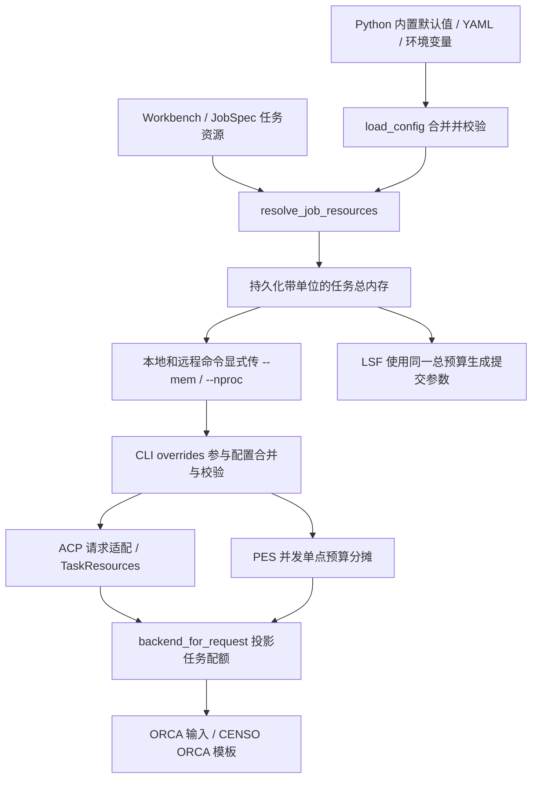

# ACP 内存配置链路与核查记录

核查日期：2026-10-10。本文描述任务总预算如何传到实际计算输入；不把预算参数等同于操作系统级的内存隔离。

## 统一链路



- 权威默认值是 `cccp.config._get_default_config()`：总内存 `30GB`，资源 CPU 数 `16`，ORCA 自动内存安全系数 `0.8`。用户配置和任务指定值可覆盖默认值；YAML 默认文件同步描述相同规则。
- 调度器在新任务提交和原地重算时解析并保存有效的 `resources.mem` 与 `resources.nproc`。本地/远程命令都显式传递这两个值，避免计算节点自己的内存默认值改变任务预算。
- `cccp.calculation` 构造后端时把显式 `TaskResources` 写入独立的配置副本，同时更新 ORCA 的 CPU 配置；不修改调用方配置。
- ACP 兼容转发中的预构造后端同样应用已转换的任务配额；TS 输入临时调整进程数时重新计算自动 maxcore，并重新校验显式/原始 maxcore。
- 任务已有资源保持其明确值；历史任务缺失资源时由执行命令生成处兼容解析默认值。已启动的进程不会因代码更新重新获得内存设置。

## 单位与覆盖规则

| 边界 | 无单位值 | 推荐形式 |
| --- | --- | --- |
| YAML、环境变量、ACP CLI、JobSpec、ACP 兼容 CalculationRequest | GB | `8GB`、`8192MB` |
| 公开 CCCP TaskResources 契约 | MB（整数和纯数字字符串） | `8192`、`8GB` |
| ORCA `%maxcore` / TaskResources.maxcore | 每进程 MB | 正整数 |

两种既有无单位契约保留兼容性，但共用 `cccp.utils.resource_utils` 的解析实现，并由 ACP 适配边界加上明确单位。`1GB = 1024MB`，`1TB = 1024GB`；支持大小写、空格、单字母单位和小数。不接受布尔值、负数、零、非有限值或无法解析的文本。实际需要整数 MB 的执行入口拒绝小于 1MB 的预算。

配置合并完成后才校验 CLI 覆盖值；因此 `--mem 0GB` 不再绕过配置校验。任务显式值优先于运行配置；未指定的字段继续使用运行配置。

ORCA 自动值为：

```text
maxcore_mb = floor(total_mem_mb × orca_maxcore_safety / actual_nproc)
```

默认系数为 `0.8`。例如总预算 `32GB`、`16` 个进程，最终输入为 `%maxcore 1638`。显式 `maxcore` 保留，但必须满足 `maxcore × actual_nproc <= total_mem_mb`；原始输入块中的 `%maxcore` 同样校验，最终只生成一条内存指令，互相冲突的原始指令直接报错。

`%maxcore` 是 ORCA 主工作区的每进程内存设置，实际总占用可能高于这个值，自动值留出 20% 余量。这与 [ORCA 官方内存说明](https://www.faccts.de/docs/orca/6.1/tutorials/first_steps/memory.html) 一致。

## 本次确认并修复的断点

| 断点 | 修复结果 | 实现位置 |
| --- | --- | --- |
| 多份单位解析器与非法值处理不同 | 共用解析实现；ACP→CCCP 显式转换单位 | `utils/resource_utils.py`、`calculation/requests.py`、`acp/calculations/legacy_adapters.py` |
| CLI 在校验后直接改内存值 | overrides 先参与合并，再统一校验 | `acp/cli.py::_build_config` |
| 多数任务的 TaskResources 没有传给后端构造器 | 各任务构造后端时投影任务配额 | `calculation/_common.py::backend_for_request` 与 `calculation/tasks/` |
| ORCA 独立 maxcore 配置和原始输入块可超出总预算 | 显式值校验；原始内存指令合并 | `qc/interfaces/orca.py` |
| IRC 独立写入器漏写内存与并行数 | 写入同一个接口对象的 maxcore/nproc | `ORCAInterface.irc` |
| PES 并行 SP 只分 CPU，各子任务获得整份内存 | CPU 与总内存共同分摊 | `acp/calculations/pes/scan.py::_sp_resource_plan` |
| CENSO 不消费任务内存配置 | 各活动 ORCA 阶段模板注入同一每核预算 | `qc/interfaces/censo.py::_memory_templates` |
| 远程 LSF 使用另一套默认值，并设置每核最小值 | 本地/远程共用任务资源解析；保留精确总预算 | `acp/scheduler/resources.py`、`remote/script_gen.py` |
| 运行记录使用另一个内存解析器/别名覆盖明确 mem | 共用解析器，并以规范字段 mem 为准 | `acp/scheduler/provenance.py` |

## 并发与执行边界

PES 单点阶段按 `workers` 分摊总内存，每个工作线程拿到 `floor(total_mem_mb / workers)`。例如 `16` 核、`32GB` → `4` 个并发子任务，各 `4` 核、`8192MB`，各自自动生成 `%maxcore 1638`。BatchOptimize 的项目与当前 NMR GIAO 计算顺序执行，不额外分摊串行步骤的总预算。

CENSO 自行安排 ORCA 子进程的 CPU 数，因此模板用任务总 CPU 数计算每核内存；在子任务总核数不超出任务核预算的前提下，所有同时执行子任务的主工作区总预算不会超出任务预算。模板同时保留调用方的其他输入行；拒绝另行塞入 `%maxcore`。模板路径与 `{main}` / `{geom}` 替换机制来自 [CENSO 官方 ORCA processor](https://github.com/grimme-lab/CENSO/blob/main/src/censo/processing/orca_processor.py)。

LSF 提交保留项目既有 OpenLava 行为：`-M = int(total_mem_mb × 1024 × 1.05)`，即 KB 与 5% 额外余量。新增精确总内存字段避免每核取整改变请求；撤销每核最少 256MB 的隐式放大。例如 `1GB / 64` 核仍是 `1GB` 的任务预算。

运行时显式提供已构造的 `TaskContext.backend` 或注册实例时，调用方仍负责那个实例的资源设置。这是已有 API 的实例托管约定，任务层不会改写共享实例。xTB/CREST 等接口当前没有将总预算转换为进程硬限额；本次统一了后端配置中的预算传递，实际峰值仍由程序行为及已有远程调度限制决定。

## 发布说明与兼容性变化

- **调度任务 CPU 权威来源为 `JobSpec.resources.nproc`。** 缺失时取全局 `resources.nproc`（内置默认 16），提交时保存，并通过 `--nproc` 同步覆盖 `executables.orca.nproc`。因此此前依赖 ORCA 专用默认 10 核或另一处用户配置的调度任务，实际核数可能变化。这是任务 CPU 预算与远程申请保持一致的预期行为；需要指定 ORCA 核数的调度任务应设置任务资源。直接 CLI 未指定 `--nproc` 时仍保留已有 ORCA 专用配置语义。
- **显式 maxcore 超出总预算时拒绝执行。** 例如总预算 `30GB`、16 个进程、`maxcore=2000MB`，需求为 `32000MB`，大于预算 `30720MB`，现在报错。用户需降低 maxcore、降低进程数或提高总预算；不会静默削减显式值或扩大内存预算。自动换算仍使用安全系数，显式值仅要求不超过总预算。
- **原始 `%maxcore` 优先于配置中的显式 pin。** 两者不同且都通过预算校验时，保留原始输入指定值并记录 warning；最终输入只输出一条 `%maxcore`。
- **非法内存不再兜底。** 空字符串、零和无法解析的文本直接拒绝。CLI 统一使用参数错误提示并以状态码 2 退出；库调用继续抛 `ValueError`。
- **NMR 直接命令入口与调度入口一致。** `_build_nmr_cmd` 幂等解析任务资源，使本地、远程命令即使由调用方直接构建，也携带同一组有效内存与进程数。

工作区同时包含 scan 坐标类型、SCF 约束和前端工作台修改。合入时应按功能拆分，避免把这些改动包含在内存链路提交中；混合文件包括 `acp/cli.py`、`qc/interfaces/orca.py`、`tests/test_cccp_route_render.py` 和 `tests/test_f4_scope_audit.py`，需按改动块选择。

## 回归证据

`tests/test_memory_resource_chain.py` 检查单位边界、CLI 覆盖校验、调用方配置不变、实际 ORCA 输入、原始内存覆盖、PES 并发总量、CENSO 实际模板与远程提交脚本。ORCA 覆盖 singlepoint、普通优化、frequency、scan、IRC、CASSCF、NMR shielding、gradient 的自动值与显式值。

测试同时覆盖 TS 优化的输入写入。测试替换计算程序的启动步骤，检查启动前已经生成的真实输入文件与参数；未以这些回归测试替代真实 ORCA/CENSO 长时间计算的峰值内存测量。QC 接口改动登记为 `tests/test_f4_scope_audit.py` 的 Amendment S，并保留限定范围与负向注入断言。

首轮验证（复核前）：任务/调度/远程等相关回归 1,224 项通过（3 项跳过、1 项按慢测筛选排除）；最后补齐兼容入口与 TS 覆盖后，包含内存专项、scan、simple、兼容适配与 CCCP 任务的 387 项回归通过；F4 范围护栏 27 项通过。各测试集合有重叠，不合计为独立测试总数。Python 3.11 编译与新增模块的 Ruff 检查通过。该轮完整非慢测套件未完成，因此相关回归通过不足以作为交付完成依据。

复核整改：补齐四处裸构造 ORCA 夹具的内存状态，更新三处后端构造 mock 的资源关键字签名，并让本地 NMR 直接命令入口解析资源。审查报告中的 51 项回归全部修复，原有断言保留。内存专项由 40 项补至 60 项，新增覆盖 CLI 错误呈现、非法 CPU/历史资源别名、默认值回退与规范字段优先级；已有 raw maxcore 测试补充 warning 断言。

整改后验证：

- `pytest -m 'not slow' -q --disable-warnings --maxfail=5 -o faulthandler_timeout=60` 完整结束：**8,001 passed、11 skipped、92 deselected**，退出码 0，耗时 1,643.25 秒。运行期间 F4 长时间 AST 审计触发诊断堆栈输出，最终护栏通过。真实 QC 测试沿用既有慢测/集成门控；该结果不代表真实程序峰值内存测量。
- 涉及回归的文件、ORCA 接口及内存专项：368 passed、1 skipped。此集合包含于全量结果，不重复合计。
- `scripts/check_grep_gates.py --suite architecture-remediation` 的 10 项架构门通过，blocking findings 为 0。
- Python 3.11 编译通过；本轮修复的测试及新模块 Ruff 检查通过，CLI、runner、ORCA 与 HEAD 对比无新增 Ruff 问题；`git diff --check` 通过。

提交卫生：e2e 测试生成的路径记录恢复为 HEAD 内容；删除仓库根的 mock gradient 输出并添加精确忽略规则；在夹具目录的负向忽略规则之后补 `__pycache__/`，避免缓存重新进入待提交文件。
