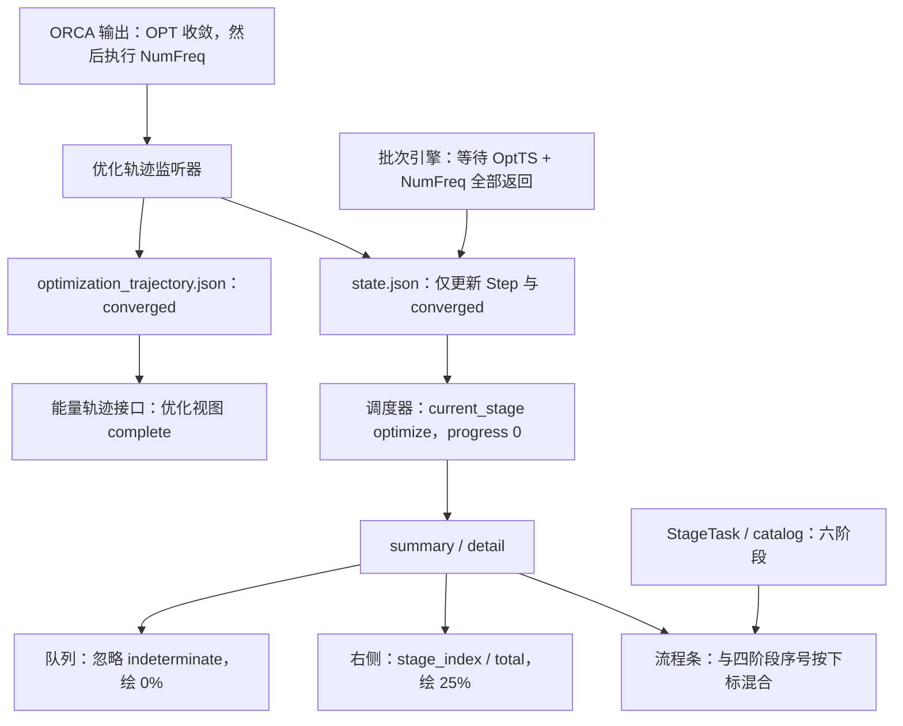

# ACP 任务进度与可视化同步问题报告

调查日期：2026-10-01；时间统一按北京时间（UTC+8）说明。  
对象：`20260930_110815_003_BatchOptimize` / `TS2_STEPWISE_BatchOptimize_PUBLICATION`。  
主要现场快照：14:52:52；复核快照：15:01:25。  
调查方式：实际服务只读接口、计算输入/输出与状态文件、当前源码、模拟输出复现、现有测试。此次未修改业务代码、任务配置或数据库，未暂停、重跑或重启正在运行的任务。

## 1. 结论

**用户观察成立。根因是计算阶段定义与状态上报边界不一致，并叠加前端进度与阶段名称映射错误。**

截图中“第 47 周期已收敛”与“任务仍在 OPT”来自两套独立数据：优化轨迹监听器已识别几何收敛；但底层 TS 优化调用实际上包含 `OptTS + NumFreq`。ORCA 在几何收敛后继续执行数值频率分析，ACP 只有在整次调用返回后才把 `optimize` 标记完成。因此，在这段数值频率计算期间，工作流状态仍写作 `optimize`、0%、1/4，未产生 `frequency` 开始事件。

这不是计算停止，也不是仅靠刷新页面可以解决的缓存现象。**14:52:52 的实际 ORCA 输出已宣布到数值频率位移任务 160/168，但 `state.json` 仍停在 14:22:36 的 OPT 收敛状态。**这里的 160 表示已宣布正在计算的位置，不能当作 160 个位移均已完成。

调查中继续观察到：14:57:24，组合调用返回后 ACP 才切换到独立 `frequency` 阶段；15:01:25 时任务仍处于该阶段，进度为 0.25、2/4。第一次内置数值频率分析已耗时 **2065.748 秒，约 34.429 分钟**；随后出现 `WORK/04_FREQ/freq.inp`，确认又启动了独立 FREQ。

**还确认了一项涉及计算配置可信度的问题：任务请求 BS singlet / GuessMix 45°，但 TS 优化输入未写入这些设置，实际输出标记 `HFTyp ... RHF`；后续独立 FREQ 输入却写入 `HFTyp UHF` 和 `GuessMix 45`。**这意味着 OPT 与 FREQ 的电子态控制不一致。即使修好了进度条，也不能仅根据页面上的 BS 标签或“converged”接受本次结果，需要进一步核验电子态和频率对应关系。

## 2. 实际任务与配置

| 项目 | 已核实的现场值 |
|---|---|
| 工作流 / profile | `BatchOptimize` / `opt_freq_sp_thermo` |
| 本次执行 | 第 2 次 attempt；2026-10-01 13:30:12 开始 |
| 输入数量与角色 | 1 个结构，`TS`，29 个原子 |
| 电荷 / 多重度 | 0 / 1 |
| TS OPT / FREQ 方法 | 实际输入为 `wB97X-D4 / def2-SVP` |
| 后续 SP 方法 | `wB97M-V / def2-TZVPP` |
| 资源 | 16 核，mem 配置 `32`，parallelism=1 |
| 执行位置 | 本机 WSL，`node_id=local`，不是远程 LSF 任务 |
| 数据目录 | `/var/lib/acp/runs/f8022072-48bf-43c8-83e6-d4daac8106b0/TS2_STEPWISE_BatchOptimize_PUBLICATION` |
| TS 几何设置 | TightOpt、Calc_Hess、Recalc_Hess 5、Trust 0.3、几何 MaxIter 200；这些确实进入输入 |
| 请求的 SCF 设置 | TightSCF、SCF MaxIter 300、normal 策略 |
| 请求的电子态 | `s1_bs`，broken_symmetry，GuessMix 45，spatial_symmetry=disable |
| 服务状态 | 0.1.3，WSL Python 3.12.12，运行任务数 1 |

配置中 `levels.batch.functional/basis` 仍保留 `r2SCAN-3c / def2-mTZVPP`，但角色配置与扁平优化字段覆盖为 `wB97X-D4 / def2-SVP`。实际 `.inp` 与接口 `display_method` 都支持后者，本次不能把嵌套字段中保留的默认方法当作真正执行的方法。建议报告和页面继续以生效配置及输入文件为依据。

证据：[任务配置与原始接口](evidence/job_raw.json)、[详情及 effective_config](evidence/job_detail.json)、[OPT 输入](evidence/ts_opt.inp)、[独立 FREQ 输入](evidence/freq.inp)。

## 3. 现场时间线与状态对照

| 时间 / 位置 | 真实计算或文件状态 | ACP 状态 / 页面含义 |
|---|---|---|
| 13:30:12 | 当前 attempt 开始 | job running |
| 13:30:14 | 开始 TS 优化 | `optimize` running；stage_index=1，stage_total=4 |
| 14:22:36 | 第 47 周期几何收敛；优化指标写入 state | `opt_step=Step 47`，`opt_convergence=converged`；但阶段仍是 optimize |
| 14:52:52 快照 | 同一 `ts_opt.out` 已进入 ORCA NUMERICAL FREQUENCIES，并宣布到位移 160/168 | state.updated_at 仍为 14:22:36；OPT running，FREQ pending，overall_progress=0 |
| 14:57:24 | `OptTS + NumFreq` 整体返回，随后独立 FREQ 启动 | OPT completed；FREQ running；overall_progress=0.25；stage_index=2/4 |
| 15:01:25 快照 | `WORK/04_FREQ/freq.inp` 已存在；独立 FREQ 正在运行 | state 阶段正确切为 frequency；summary 的 DB 时间仍滞后于原始接口 |

第一次组合调用的 `ts_opt.out` 关键行：

- 第 71176 行：`THE OPTIMIZATION HAS CONVERGED`。
- 第 72774 行：`ORCA NUMERICAL FREQUENCIES`。
- 第 72781 行：`Number of displacements ... 174 - 6`；后续位移消息使用总数 168。
- 14:52 快照最后一条位移消息：`Calculating gradient on displaced geometry 160 (of 168)`。
- 复核时第 74813 行：`ORCA TERMINATED NORMALLY`。
- 复核时末尾计时：`Numerical frequency calculation ... 2065.748 sec (= 34.429 min) 60.3 %`。

后一次观察的进程记录显示 ACP CLI 进程 PID 114434 仍存在，随后生成的独立 FREQ 输入进一步支持计算正在推进。进程存在本身不足以证明每个计算子步骤正常，但结合输出推进和阶段切换，可排除“任务在几何收敛后一直停住”的解释。

证据：[初始 state](evidence/state.json)、[ORCA 输出摘录及原行号](evidence/ts_opt_out_excerpt.txt)、[初始输出摘要和哈希](evidence/ts_opt_out_markers.json)、[15:01 复核快照](evidence/live_followup.json)。

### 3.1 截图为什么同时显示“已收敛”和“运行中”

初始 energy-graph 接口给出的优化视图是：

```json
{
  "view_type": "optimization",
  "status": "completed",
  "complete": true,
  "metadata": {
    "current_cycle": 47,
    "live": false,
    "job_status": "running"
  }
}
```

该接口的 `completed` 表示优化轨迹已收敛，不等于整个 BatchOptimize 已完成。`build_optimization_energy_graph()` 使用轨迹的 `converged` 推导视图状态；工作流状态则来自根目录 `state.json`。因此中心图的几何收敛结论有实据，真正缺失的是“OPT 已收敛，当前正在后续频率分析”的阶段说明。

数据质量 `complete` 也只说明已捕获的优化周期数据齐全，不能证明频率、SP、热化学已完成。当前图仍可保留作为已完成阶段的历史轨迹，但应明确当前任务阶段。

源码：[优化视图完成判断](../../../src/acp/results/energy_graph.py#L573)；证据：[优化 energy-graph 全响应](evidence/optimization_energy_graph.json)。

## 4. 问题清单

P1：影响核心阶段识别、计算资源或结果可信度，应优先处理。P2：影响显示一致性、观测可信度或多输入进度，随后修复。

| 编号 | 优先级 | 问题 | 证据强度 |
|---|---|---|---|
| F01 | P1 | TS 优化调用内置数值频率，ACP 未上报该内部阶段 | 现场输出、state、源码及模拟输出复现 |
| F02 | P1 | 内置 NumFreq 后又启动独立 FREQ，缺少复用/阶段规划 | 两次实际输入、终止输出、后续 state，已实证 |
| F03 | P1 | TS OPT 丢弃 SCF/电子态设置，OPT 与独立 FREQ 的状态控制不一致 | 实际输入、RHF 输出、运行警告、模拟输入复现 |
| F04 | P2 | 队列忽略 indeterminate；右侧用阶段位置当完成比例 | 实际前端函数执行复现，0% 与 25% 并存 |
| F05 | P2 | reporter 四阶段与 scheduler 六阶段不一致，流程名称错位 | 两种实际 API、计划编译与前端执行复现 |
| F06 | P2 | StageTask 数据库生命周期未同步，详情 overlay 丢失阶段时间 | 实际 /tasks、/detail、state 与源码 |
| F07 | P2 | 状态增强缓存存整份模型，回传旧 DB 字段 | 两次现场接口对照、隔离复现 |
| F08 | P2 | 优化指标覆盖批次上下文；多输入整体进度会回退 | 当前指标快照、模拟输出与两输入生命周期复现 |

### F01：真实 FREQ 被包在 OPT 调用中，状态无法及时切换

调用链为：

```text
BatchOptimizeEngine._process_item()
  → reporter.start_stage("optimize")
  → run_optimize(TS)
  → call_capability("transition_state_opt")
  → ORCAInterface.transition_state_opt()
  → ts_opt_route() 固定追加 NumFreq
  → _run_orca() 等待 OptTS + NumFreq 全部结束
  → run_optimize() 返回
  → reporter.complete_stage("optimize")
  → reporter.start_stage("frequency")
```

`OptimizationTrajectoryRecorder.feed_line()` 可以识别收敛行，并经 `publish_cycle()` 写入 Step 47 / converged。但它没有识别 `ORCA NUMERICAL FREQUENCIES` 或位移计数为独立阶段；`publish_cycle()` 只替换指标，不调用阶段切换。数值频率不再产生优化周期，因此 state 与事件也停止更新。

调度器的 `_observe_state()` 会持续读取 state，把 state 的 current_stage/overall_progress 原样用于任务记录。它没有从 ORCA 输出重新推断物理阶段。本次 state 本身就写着 OPT，调度器及前端无法凭更高轮询频率得到正确 FREQ 阶段。

**影响：**在几何收敛后的整段内置频率计算中，页面显示过时的阶段和指标；左侧实时日志只见 OPT 开始事件，没有 FREQ 事件；用户容易误判同步中断。

**处理建议：**为底层组合调用增加明确的物理子阶段事件，至少报告 `optimize → frequency_validation` 和位移观测；或者在计划层拆为单独 OPT 与 FREQ。单纯在捕获收敛行时强行把整个任务标为完成会造成新的错误，应保持 job running。

源码：[批次阶段边界](../../../src/acp/calculations/batch/engine.py#L883)、[优化调用](../../../src/acp/calculations/batch/engine.py#L929)、[完成阶段](../../../src/acp/calculations/batch/engine.py#L1102)、[TS 路由固定 NumFreq](../../../src/cccp/qc/interfaces/orca_ts.py#L362)、[同步等待组合调用](../../../src/cccp/qc/interfaces/orca.py#L3130)、[只发布优化指标](../../../src/acp/calculations/primitives/optimize.py#L435)、[调度器读 state](../../../src/acp/scheduler/runner.py#L1046)。

### F02：额外频率计算已发生，不能当作同一频率结果的自动复用

`transition_state_opt()` 已在 OPT 调用内执行独立数值频率，并返回频率；批次引擎随后仍在 `StepKind.FREQUENCY` 分支调用 `run_frequency(req)`，没有根据已有频率产物跳过或复用。

本次现场先有 `WORK/03_OPT/ts_opt.inp` 的 `OptTS ... NumFreq`，再有 `WORK/04_FREQ/freq.inp` 的 `Freq`。第一次数值频率耗时约 34.429 分钟，占整个组合调用时间的 60.3%。这段额外计算不仅影响显示，也实际占用了资源。

**不能简单判定为“完全相同条件的重复计算”。**本次两次输入虽然方法与基组相同，但独立 FREQ 添加了 UHF/GuessMix，内置频率仍随 RHF 优化执行。建议解决 F03 后，依据方法、基组、电子态、几何、溶剂、频率设置的完整指纹决定是否复用。现阶段直接复用第一次频率会掩盖电子态不一致。

`opt_only` 也经过同一个 TS 接口，因此即使 profile 没有声明 frequency，仍可能执行内置 NumFreq。是否有意保留 TS 验证，需要在 profile 语义和页面阶段中明确；不能把隐藏计算当作“纯 OPT”。

源码：[TS 接口语义](../../../src/cccp/qc/interfaces/orca.py#L2982)、[独立频率分支](../../../src/acp/calculations/batch/engine.py#L1024)。

### F03：配置页面与实际 TS 输入不一致，BS 设置未落实

当前 task spec 明确含有 broken_symmetry / GuessMix 45 / 禁用空间对称性。公共 primitive 管道把它们转换为 `scf_options` 并传给能力接口。但 TS 专用实现既没有消费 `scf_options`，也没有调用通用的 SCF/轨道块渲染函数。

启动日志已有明确警告：

```text
Unused ORCA transition_state_opt kwargs for ts_opt:
['opt_max_rescue', 'opt_rescue_policy', 'scf_convergence',
 'scf_maxiter', 'scf_options', 'scf_strategy']
```

实际 OPT 输入只有：

```text
! wB97X-D4 def2-SVP OptTS TightOpt NumFreq
%pal nprocs 16 end
%geom
  Calc_Hess true
  Recalc_Hess 5
  Trust 0.3
  MaxIter 200
end
```

无 `%scf`、`GuessMix`、`NoUseSym`，无 SCF MaxIter 300；输入中的 `MaxIter 200` 位于 `%geom`，是几何优化设置，不能替代 SCF MaxIter。复核输出第 896 和 71796 行均为 `HFTyp ... RHF`。

实际独立 FREQ 输入则含：

```text
! wB97X-D4 def2-SVP Freq NoUseSym Moread TightSCF
%maxcore 1638
%pal nprocs 16 end
%scf
  HFTyp UHF
  GuessMix 45
  MaxIter 300
end
%moinp ".../WORK/03_OPT/ts_opt.gbw"
```

**已证实：**TS 优化未按请求写入电子态/SCF 控制，后续频率输入改变了这些控制。  
**尚未证实：**独立 FREQ 最终会收敛到什么电子态、最终频率和 TS 身份是否满足预期；本报告不作最终科学有效性判定。

此外，TS 输入没有像独立 FREQ 一样输出 `%maxcore`。本次请求的 mem=`32` 因而不能直接视为 OPT 阶段已生成相应的 ORCA 内存块；此次没有做实际内存占用或限额审计，不据此认定发生了内存故障。

警告中的 `opt_rescue_policy/opt_max_rescue` 已由上层 `run_optimize()` 使用，因此不能把它们一概视为全链路失效。应分别验证上层消费字段与应落到 ORCA 输入的字段；此处真正明确丢弃的是 SCF 与电子态控制。

**处理建议：**TS 输入构造应复用通用 `scf_route_extras`、`render_scf_block`、`render_moinp_block` 等能力；将支持字段与生效字段对照写入 provenance；对于已声明支持但未消费的电子态参数，至少明确拒绝或报告错误，避免仅有日志警告后继续运行。生效配置摘要不能替代实际输入验证。

源码：[scf_options 传递](../../../src/acp/calculations/primitives/_common.py#L336)、[TS 参数提取及 unused 警告](../../../src/cccp/qc/interfaces/orca.py#L3058)、[TS 专用输入生成](../../../src/cccp/qc/interfaces/orca.py#L3095)。证据：[OPT 输入](evidence/ts_opt.inp)、[FREQ 输入](evidence/freq.inp)、[输出中的 RHF 标记](evidence/live_followup.json)、[独立复现](evidence/python_reproductions.json)。

### F04：同一任务的两根进度条使用了不同含义

队列的 `isProgressKnown()` 仅检查 `typeof job.progress === "number"`；`isProgressIndeterminate()` 依赖这个判断，没有检查后端 `progress_state`。

本次后端明确给出 `progress_state="indeterminate"`，但 progress=0.0 仍是数值，因此队列显示 0%。这会把“当前阶段完成比例未知”表现成确定的 0% 停滞。

右侧信息面板的进度条采用 `stage_index / stage_total`。在第一个阶段刚开始时，1/4 已绘为 25%；独立 FREQ 开始时，2/4 绘为 50%，而后端只确认完成一个阶段，overall_progress=25%。**阶段序号表示当前位置，不能直接当成完成比例。**

实际前端函数复现结果：队列 helper 返回 indeterminate=false、队列显示 0%；右侧阶段位置进度=25%。这与截图吻合。

**处理建议：**显示模型区分整体完成比例、当前阶段比例与当前位置。百分比统一使用后端整体进度；current-stage 不可估计时用活动条和具体观测文字；“阶段 1/4”继续作为位置标签。若保留阶段位置条，应明确命名并避免与完成进度混用。完成到最后一个阶段时也不应在工作尚未结束前绘成任务已 100%。

源码：[进度 helper](../../../frontend/ACP_Workbench_v2.html#L9992)、[队列进度绘制](../../../frontend/ACP_Workbench_v2.html#L17591)、[右侧 stage_index 比例](../../../frontend/ACP_Workbench_v2.html#L18852)。证据：[实际前端执行结果](evidence/frontend_reproductions.json)。

### F05：四阶段序号映射到六阶段名称，流程条错位并遗漏后续节点

reporter 的 stage list：

```text
optimize → frequency → single_point → thermochemistry
```

catalog / PlanCompiler / StageTaskStore 的 stage list：

```text
prepare → optimize → frequency → single_point → thermochemistry → finalize
```

前端 `renderWorkflowTimeline()` 用 reporter 的 stage_total=4 创建四个节点，却按数组下标从 detail.stages 取名称。因此实际绘制的名称为：准备、结构优化、频率计算、单点能。热化学与完成节点没有画出。stage_index=1 对应 OPT 时，第一节点却显示“准备”；切到真实 FREQ 的 index=2 时，名称会仍显示“结构优化”。

**处理建议：**API 返回一份有明确 stage_id/order/status 的权威阶段列表，timeline 通过 stage_id 关联当前阶段。统一决定 prepare/finalize 是否计入工作流；不得混用两份不同列表的序号和名称。

源码：[reporter 阶段名](../../../src/acp/calculations/batch/engine.py#L108)、[catalog 六阶段](../../../src/acp/catalog.py#L3449)、[计划按 profile 编译](../../../src/acp/scheduler/stage_tasks.py#L333)、[timeline 按下标取名](../../../frontend/ACP_Workbench_v2.html#L18545)。证据：[stage mismatch 复现](evidence/python_reproductions.json)、[真实 DOM 生成逻辑复现](evidence/frontend_reproductions.json)。

### F06：StageTask 生命周期与 state 分离，详情显示覆盖掩盖了持久层滞后

14:52 的 `/tasks` 返回六个节点全部 pending，所有 started_at/completed_at 为空；`/detail` 通过 state overlay 把 optimize 显示为 running。但是 overlay 仍使用数据库的 task.started_at/task.completed_at，没有带入 state 中的阶段时间。因此详情里 OPT 的开始时间为空，尽管 state 已写有 13:30:14 的 started_at。

`StageTaskObserver.poll_and_mirror()` 只读取 `work_dir/stage_tasks/**/*.json`。本任务目录没有对应 lifecycle 输出；ProgressReporter 写的是根目录 state.json。`_observe_state()` 又只镜像 status_detail，没有持久化 state 的完整阶段生命周期。

**影响：**同一任务的 `/tasks` 与 `/detail` 状态不一致；阶段耗时难以显示；终态时未更新的 StageTask 还可能被 finalize_job 当作 unfinished 统一投影为 skipped。后者是代码路径风险，本次尚未观察到任务终态。

**处理建议：**采用统一的阶段事件写入或从 state 进行完整生命周期镜像；detail overlay 同步处理时间戳，并清楚声明来源。在统一阶段列表之前，应避免对 prepare/finalize 无观测数据却推断已执行。

源码：[observer 数据源](../../../src/acp/scheduler/stage_tasks.py#L484)、[runner 仅同步 status_detail](../../../src/acp/scheduler/runner.py#L1078)、[detail overlay 时间戳](../../../src/acp/api/v1_routes.py#L4500)。证据：[/tasks 原始响应](evidence/stage_tasks.json)、[/detail 原始响应](evidence/job_detail.json)。

### F07：增强缓存命中时返回旧的整份任务模型

`_enrich_job_snapshot()` 的缓存键为 `(job_id, state_mtime_ns, events_mtime_ns, include_event)`，缓存值为完整 V1JobRecordModel；命中且 status 相同就直接返回旧模型，没有把当前数据库字段重新合并。

14:52 快照中，原始 `/jobs/{id}` 的 updated_at 已推进，但 `/summary` 仍为早先缓存时间；15:01:25 的复核再次确认：原始记录为约 15:01:24，summary 仍为 14:57:26。state 在频率阶段暂无新输出，缓存键不变，因此任务 DB 的后续更新不能使整份 snapshot 更新。

隔离复现中仅更新 DB 模型的 updated_at，保持 state/event 文件不变，增强函数确实返回原来的时间戳。

**影响：**summary 与 raw 接口的记录时间和可能的其他 DB 字段滞后；前端依赖这些字段做变化检测时可能错过更新。本次 FREQ 阶段延迟的首要原因仍是 F01，因为 state 本身没有切换；不能把 F07 单独视为此次主因。

**处理建议：**缓存只保存解析后的文件增强字段，每次请求合并当前 DB 模型；或把 DB 修订号纳入缓存版本。不要用 filesystem mtime 独立代表整份任务模型的版本。

源码：[缓存键与直接返回](../../../src/acp/api/v1_routes.py#L459)。证据：[两种当前接口及时间戳](evidence/live_followup.json)、[缓存复现](evidence/python_reproductions.json)。

补充：`GET /jobs/{id}` 本身不做扩展 state enrichment，`/summary` 才做；所以 raw 接口里的 live_status/stage_index 缺失不能直接当作其采集失败。前端目前使用 summary 来更新选中任务。本报告对缓存的判断基于两接口的 DB 字段差异与函数复现，而非把扩展字段缺失混为同一个问题。

### F08：指标上下文会消失，多输入整体比例不具备单调性

引擎开始步骤时设置 `batch_item`、`batch_step`。优化回调随后调用 `set_live_metrics()`，该函数替换整个指标列表，所以当前任务优化期间只剩 `opt_step`、`opt_convergence`；批次位置消失。独立 FREQ 开始后批次指标又重新出现，界面指标含义随阶段改变。

另外，多个输入共用同一个四阶段 reporter，`start_stage()` 重用 stage 状态；整体进度的分母只按四个 stage 计算，没有计入输入数。独立生命周期复现显示：第一个输入的四个步骤完成时 overall_progress=1.0；第二个输入开始 OPT 时降回 0.75。

**范围：**本次仅一个输入，进度回退尚未发生；该条是同一实现的可复现多输入缺陷，不能称为当前任务已回退。指标覆盖则在当前任务中已发生。

**处理建议：**批次维度指标与阶段维度指标分别管理；整体完成单位定义为已完成 item-step 数 / 全部 item-step 数，并为 cache skip、失败继续、电子态展开、重试明确计数规则。优化周期数和位移编号是观测指标，不应未经估计直接换算成整体百分比。

源码：[替换 live metrics](../../../src/acp/calculations/progress.py#L181)、[仅按 stage 计算整体进度](../../../src/acp/calculations/progress.py#L189)、[优化回调覆盖](../../../src/acp/calculations/primitives/optimize.py#L441)。证据：[模拟输出与多输入生命周期复现](evidence/python_reproductions.json)。

## 5. 同步链路判断



前端已有任务列表约 4 秒、summary 约 2.5 秒、能量视图约 5 秒、日志约 5 秒的轮询。此次服务实际提供的工作台 HTML 与工作区文件在换行规范化后完全一致，能直接复现上述 helper 行为。因此既不需要通过提高轮询频率来解释问题，也没有证据把主因归为旧版服务端静态页面。

没有读取用户原浏览器标签的网络日志或缓存内容，所以不能完全排除原浏览器同时存在别的局部刷新问题；但当前服务和当前源码已经能独立解释截图中的核心症状。

本次是本地任务，未经过 RemoteStructureCache/SFTP。远程缓存不应列为此次根因；远程工作流是否存在同类问题，需要在修复时另外覆盖，不在本次现场结论中作实证声明。

源码：[轮询节奏](../../../frontend/ACP_Workbench_v2.html#L31220)。证据：[实际服务前端一致性](evidence/frontend_comparison.json)。

## 6. 修复顺序与建议显示

1. **先处理 TS 配置消费与计算边界（F03、F01、F02）。**确保电子态和 SCF 控制进入实际 TS 输入；确定 OPT 与频率验证的职责。保留组合调用时必须上报内部子阶段；拆开时应保证 TS 验证、Hessian、normal_modes、GBW 继承、检查点及失败恢复仍正确。
2. **统一 API 阶段合同与持久化（F05、F06）。**同一任务只使用一份阶段 ID/顺序/状态/时间；prepare/finalize 的计数原则一致；保留对历史状态文件的读取兼容。
3. **统一页面进度含义（F04）。**整体百分比来自后端完成单位；位置标签独立展示；未知阶段用活动条；轨迹已收敛可继续显示，但附带当前 FREQ/验证阶段说明。
4. **修复 snapshot 缓存及指标作用域（F07、F08）。**每次响应合并最新 DB；按输入×步骤聚合进度；保留批次上下文和当前阶段观测。

建议在截图所处时刻显示：

```text
任务：运行中
几何优化：已收敛，第 47 周期
当前计算：TS 后续数值频率验证
观测：正在计算位移 160 / 168
整体流程：依据统一阶段列表显示
进度：当前完成比例未知，保留已完成阶段信息
```

建议在 15:01 的时刻显示：

```text
任务：运行中
当前阶段：频率计算
已完成：几何优化
整体完成：25%（按四个计算步骤计数时）
阶段位置：2 / 4
当前阶段完成比例：未知
历史优化轨迹：第 47 周期已收敛
```

这些示例是修复后的产品行为建议，不表示本次已经改动界面。尤其不能把 FREQ 位移的最后宣布编号当作已完成计数；若解析器只能看到启动消息，就应保留“正在计算”措辞。

## 7. 验证情况与验收要求

### 7.1 已执行的验证

- 实际服务 GET 接口：status、raw job、summary、detail、tasks、files、logs、energy-graph。
- 读取当前任务实际 OPT/FREQ 输入、ORCA 输出关键段、状态文件、优化轨迹、事件日志；保存原始 JSON 与带原行号的输出摘录。
- Python 隔离复现确认 5 类行为：内置 FREQ 不切 stage、四/六阶段不一致、多输入进度回退、完整模型缓存返回旧 DB 时间、TS 输入丢弃 SCF/电子态设置。内置 FREQ 复现同时确认 batch_item 指标被覆盖。
- Node 执行当前工作台的真实 helper 和 timeline 生成函数：确认 indeterminate 被忽略、0%/25% 含义冲突、四个节点首项误为“准备”。DOM stub 只替代环境，没有重写被验证的产品逻辑。
- 在实际 WSL Python 环境运行现有相关测试：**129 passed in 11.18s**。范围为 ProgressReporter、Batch reporter、OptimizationTrajectory、JobStatusView、StageTask。

现有测试通过不代表上述缺陷不存在：batch 测试主要把 run_optimize 模拟成直接返回，优化轨迹测试主要验证 Step/converged，没有覆盖收敛后长时间仍在同一次 ORCA 调用中执行 NumFreq，也没有验证统一阶段名称和百分比语义。

Windows Anaconda 的初次测试尝试因临时目录权限报错，没有形成可用的完整通过结果；之后改在 ACP 实际 WSL 环境成功运行。这是测试环境限制，不是据此认定 ACP 产品测试失败。

证据：[WSL 测试结果](evidence/baseline_tests_wsl.txt)、[Python 复现结果](evidence/python_reproductions.json)、[前端复现结果](evidence/frontend_reproductions.json)。复现脚本随报告保存，可复核行为；它们未运行真实 ORCA 或修改生产 manager。

### 7.2 修复后应补充的验收案例

| 情况 | 应验收的行为 |
|---|---|
| TS OPT 收敛后，NumFreq 尚在运行 | stage/子阶段正确，job 仍 running；频率观测可更新；无 OPT-only 误导 |
| 初始或周期性 Hessian 计算 | 不因出现频率文字就误判进入最终 FREQ；解析应结合收敛边界及输出上下文 |
| 内置数值频率完成后 | 依据完整指纹明确复用、跳过或另算，不隐式重做；产物与 thermochemistry 输入一致 |
| BS singlet TS | 实际 TS 输入包含所请求的 SCF/电子态控制；输入与生效摘要一致 |
| FREQ 改变电子态控制 | 保留明确来源和验证，不能仅靠 inherited GBW 认定与 OPT 同态 |
| 一般 INT 优化 | 不受 TS 专用改动影响；阶段边界、频率与轨迹仍正确 |
| opt_only 的 TS | 是否包含频率验证有明确合同与显示；不能隐藏额外计算 |
| indeterminate + 数值 progress | 队列遵守后端语义；右侧不把 stage_index 当作完成数 |
| 四阶段 / 六阶段 / 历史任务 | 当前名称通过 stage_id 对齐；所有实际阶段均能显示 |
| /tasks /detail /summary 一致性 | stage 状态与时间一致，阶段耗时可计算 |
| DB 更新而 state/event 不变 | summary 返回最新 DB 字段，文件缓存仍可复用 |
| 多输入、跳过、失败继续、状态展开 | 全批次进度定义明确且不发生无解释回退，批次上下文持续可见 |
| 收敛后频率失败 / 取消 / 暂停 | 几何收敛事实保留；job 不被误标成功；恢复动作与产物状态一致 |
| 服务重启或源代码更新 | 不影响正在运行的旧进程；旧协议兼容、重新接管和状态来源可辨 |

## 8. 调查范围与证据使用说明

本报告调查现场 running 任务和当前工作区实现，不是全平台、全部工作流或最终科学结果审计。工作区在调查开始前已有多项未提交修改，报告按当前实际代码形成，并保留了它们；不据此宣称问题一定存在于某个历史发布版本。

独立 FREQ 在最后一份快照中仍运行，最终 imaginary frequency 数量、电子态诊断、SP/热化学与 job 终态未作验证。报告中的“配置不一致”已经有输入与输出实证；最终结果是否能用于目标 TS 分析仍需后续核验。

证据按读取时刻留存，接口间不是一个数据库事务快照；比较结论基于明确状态字段、分钟级滞后及独立复现，而不是依赖毫秒级一致性。初始输出文件仍在增长，`ts_opt_out_markers.json` 的哈希只对应 14:52 读取的完整字节序列，不能与随后已结束的输出文件直接比对。

各文件用途：

| 文件 | 用途 |
|---|---|
| `evidence/capture.json` | 初始采集时间、接口、响应与保存文件列表 |
| `evidence/state.json`、`job_summary.json`、`job_detail.json`、`stage_tasks.json` | 初始跨层状态比较 |
| `evidence/optimization_energy_graph.json`、`optimization_trajectory.json` | 优化视图和第 47 周期证据 |
| `evidence/ts_opt.inp`、`freq.inp` | 实际输入、电子态/SCF 与计算类型对照 |
| `evidence/events.jsonl`、`runtime_logs.json` | 阶段事件和 unused 参数警告 |
| `evidence/ts_opt_out_excerpt.txt`、`ts_opt_out_markers.json` | 初始 ORCA 输出关键行、行号、哈希与尾部 |
| `evidence/live_followup.json` | 15:01 阶段切换、终止输出计时、RHF 与缓存时间对照 |
| `evidence/frontend_comparison.json`、`frontend_reproductions.json` | 实际服务前端版本一致性及生成逻辑复现 |
| `evidence/python_reproductions.json`、`baseline_tests_wsl.txt` | 隔离复现与相关现有测试结果 |

本次交付为问题报告与证据包，业务修复尚未实施。后续修复不宜通过手工改 state、强制完成或对当前任务直接重启来掩盖问题；应先明确 TS 配置与阶段合同，再完成实现及上述验收。
